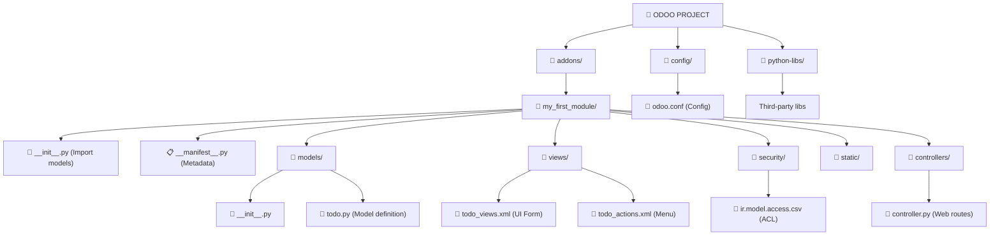
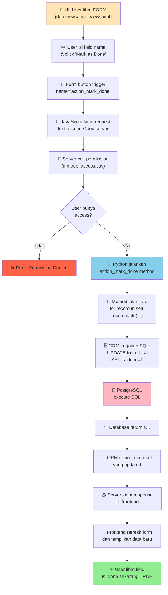
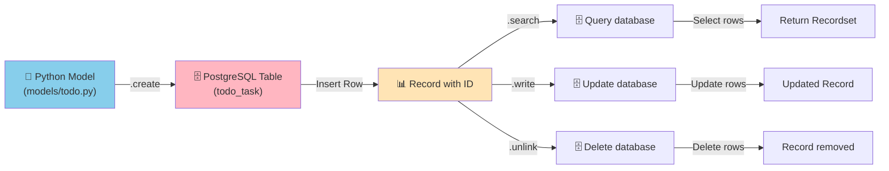
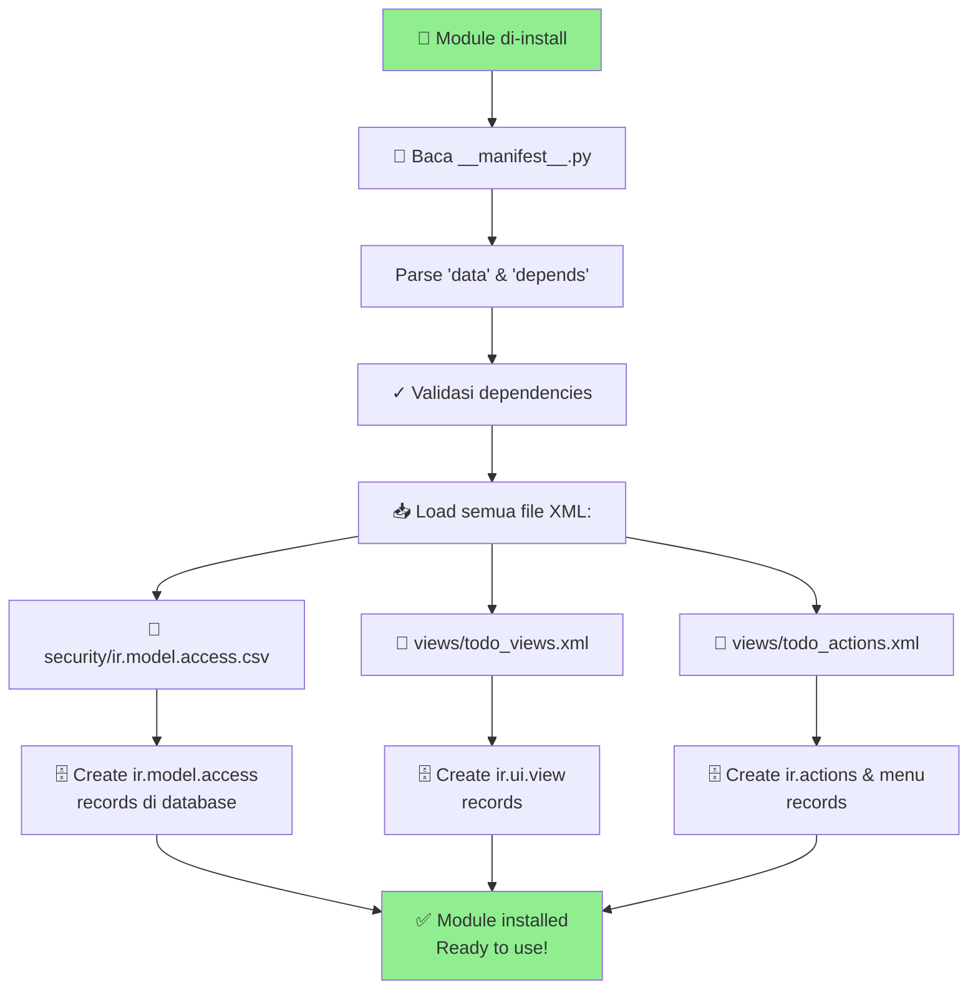
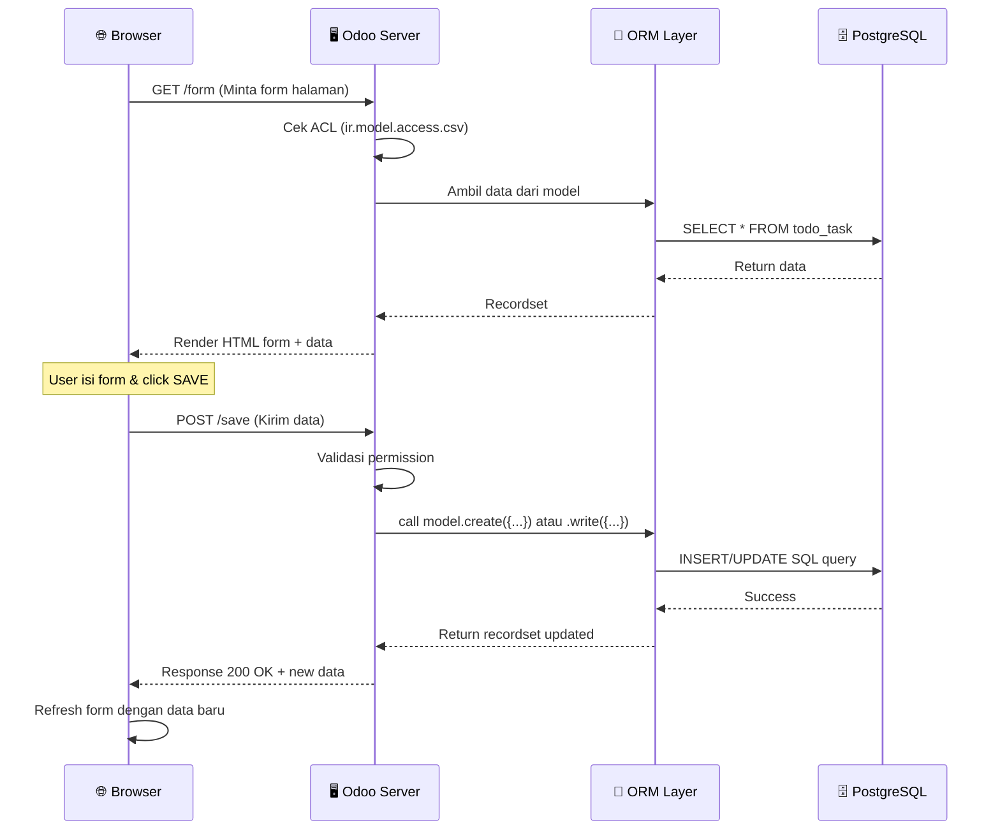

# 🔄 Odoo Complete Flow Diagram & Architecture

Panduan lengkap alur kerja Odoo dari awal sampai akhir dengan semua file dan fungsinya.

---

## 1. STRUKTUR FOLDER & FILE ODOO



---

## 2. ALUR LENGKAP DARI USER MEMBUKA FORM SAMPAI DATA TERSIMPAN

```mermaid
graph LR
    Start["👤 User membuka form\ndi browser"] 
    --> Step1["📡 Browser request ke\nserver Odoo"]
    --> Step2["🔍 Cek Security & ACL\n(ir.model.access.csv)"]
    --> Step3["📄 Load View XML\n(views/todo_views.xml)"]
    --> Step4["🎨 Render HTML/JS form\ndi browser"]
    --> Step5["✏️ User isi form\n& click SAVE"]
    --> Step6["📨 JavaScript kirim\ndata ke backend"]
    --> Step7["🔐 Server cek permission\nlagi"]
    --> Step8["🐍 Controller/Model\njalankan ORM.create()"]
    --> Step9["🗄️ PostgreSQL database\ntambah record"]
    --> Step10["✅ Response OK\nke browser"]
    --> End["🎉 Form close,\ndata tersimpan"]
    
    style Start fill:#90EE90
    style Step8 fill:#87CEEB
    style Step9 fill:#FFB6C1
    style End fill:#90EE90
```



---

## 3. FILE STRUCTURE DAN FUNGSI MASING-MASING

### 📋 A. `__manifest__.py` - Metadata Modul
**Lokasi:** `addons/my_first_module/__manifest__.py`

```python
{
    'name': 'My First Module',           # Nama modul di UI
    'version': '1.0',                    # Versi
    'depends': ['base', 'sale'],         # Modul yang dibutuhkan
    'data': [                            # File XML yang di-load
        'security/ir.model.access.csv',
        'views/todo_views.xml',
    ],
    'installable': True,
}
```

**Fungsi:**
- Menginformasikan Odoo tentang modul apa yang akan di-install
- Menentukan dependencies (modul lain yang diperlukan)
- Mengatur file XML yang akan di-load

---

### 🐍 B. `models/__init__.py` - Import Model

**Lokasi:** `addons/my_first_module/models/__init__.py`

```python
from . import todo
```

**Fungsi:**
- Membuat Python paket recognizable
- Import file model agar Odoo mengenali modelnya

---

### 🐍 C. `models/todo.py` - Definisi Model & Logic Bisnis

**Lokasi:** `addons/my_first_module/models/todo.py`

```python
from odoo import models, fields, api
from odoo.exceptions import ValidationError

class TodoTask(models.Model):
    _name = 'todo.task'                    # Nama model (table database)
    _description = 'To-Do Task'
    
    # ===== FIELD DEFINITIONS (KOLOM DATABASE) =====
    name = fields.Char(string='Task Title', required=True)
    description = fields.Text()
    is_done = fields.Boolean(default=False)
    priority = fields.Selection([('0', 'Low'), ('1', 'High')])
    responsible_id = fields.Many2one('res.users', string='Responsible')
    
    # ===== METHODS (BUSINESS LOGIC) =====
    def action_mark_done(self):
        """Tandai task sebagai selesai"""
        for record in self:
            record.write({'is_done': True})  # ORM: UPDATE
    
    @api.constrains('name')
    def _validate_name(self):
        """Validasi nama task"""
        for record in self:
            if len(record.name) < 3:
                raise ValidationError("Nama minimal 3 karakter!")
```

**Fungsi:**
- Definisi tabel database
- Definisi field/kolom
- Business logic (ORM CREATE, READ, UPDATE, DELETE)
- Validasi data

---

### 📄 D. `views/todo_views.xml` - UI Form

**Lokasi:** `addons/my_first_module/views/todo_views.xml`

```xml
<?xml version="1.0" encoding="UTF-8"?>
<odoo>
    <!-- FORM VIEW (Form input) -->
    <record id="view_todo_form" model="ir.ui.view">
        <field name="name">Todo Task Form</field>
        <field name="model">todo.task</field>
        <field name="arch" type="xml">
            <form string="Task">
                <sheet>
                    <group>
                        <field name="name"/>           <!-- Input field -->
                        <field name="priority"/>        <!-- Selection field -->
                        <field name="is_done"/>         <!-- Checkbox -->
                        <field name="responsible_id"/> <!-- Many2one relation -->
                    </group>
                </sheet>
                <!-- BUTTON: Panggil method Python -->
                <footer>
                    <button name="action_mark_done" type="object" 
                            string="Mark as Done" class="btn-success"/>
                </footer>
            </form>
        </field>
    </record>
    
    <!-- LIST VIEW (Tabel data) -->
    <record id="view_todo_list" model="ir.ui.view">
        <field name="name">Todo Task List</field>
        <field name="model">todo.task</field>
        <field name="arch" type="xml">
            <list string="Tasks">
                <field name="name"/>
                <field name="priority"/>
                <field name="is_done"/>
            </list>
        </field>
    </record>
</odoo>
```

**Fungsi:**
- Render UI form di browser
- Definisi field yang ditampilkan
- Button yang trigger method Python

---

### 📄 E. `views/todo_actions.xml` - Menu & Action

**Lokasi:** `addons/my_first_module/views/todo_actions.xml`

```xml
<?xml version="1.0" encoding="UTF-8"?>
<odoo>
    <!-- ACTION: Window action yang buka list/form -->
    <record id="action_todo_task" model="ir.actions.act_window">
        <field name="name">Tasks</field>
        <field name="res_model">todo.task</field>           <!-- Model mana yang dibuka -->
        <field name="view_mode">list,form</field>           <!-- View apa saja -->
        <field name="help">Create new task</field>
    </record>
    
    <!-- MENU ITEM: Menu di sidebar -->
    <menuitem id="menu_todo" name="Tasks"
              action="action_todo_task"
              sequence="10"/>
</odoo>
```

**Fungsi:**
- Definisi action window (buka list/form view)
- Definisi menu di sidebar

---

### 📄 F. `security/ir.model.access.csv` - Role-Based Access Control

**Lokasi:** `addons/my_first_module/security/ir.model.access.csv`

```
id,name,model_id:id,group_id:id,perm_read,perm_write,perm_create,perm_unlink
access_todo_task_user,todo.task user,model_todo_task,base.group_user,1,1,1,0
access_todo_task_manager,todo.task manager,model_todo_task,base.group_user,1,1,1,1
```

**Arti Kolom:**
- `id`: ID unik untuk ACL
- `name`: Deskripsi ACL
- `model_id:id`: Model mana (reference ke ir.model)
- `group_id:id`: Role/group mana (base.group_user, dll)
- `perm_read`: 1=bisa baca, 0=tidak
- `perm_write`: 1=bisa edit, 0=tidak
- `perm_create`: 1=bisa buat, 0=tidak
- `perm_unlink`: 1=bisa hapus, 0=tidak

---

### 🐍 G. `__init__.py` Root Module

**Lokasi:** `addons/my_first_module/__init__.py`

```python
from . import models
```

**Fungsi:**
- Python package marker
- Import subpackage (models folder)

---

### 🐍 H. `controllers/main.py` - Web Routes (Optional)

**Lokasi:** `addons/my_first_module/controllers/main.py`

```python
from odoo import http
from odoo.http import request

class TodoController(http.Controller):
    @http.route('/todo/list', type='http', auth='user')
    def todo_list(self, **kw):
        """Endpoint khusus untuk API atau custom page"""
        tasks = request.env['todo.task'].search([])
        return request.render('my_first_module.todo_template', {
            'tasks': tasks
        })
    
    @http.route('/todo/create', type='json', auth='user', methods=['POST'])
    def todo_create(self, **kw):
        """API endpoint untuk create task"""
        task = request.env['todo.task'].create({
            'name': kw.get('name'),
            'priority': kw.get('priority'),
        })
        return {'id': task.id, 'name': task.name}
```

**Fungsi:**
- Custom web routes (selain UI standard Odoo)
- REST API endpoints
- Custom templates

---

## 4. ALUR LENGKAP: USER CLICK BUTTON SAMPAI DATA UPDATE



---

## 5. FLOW DATA DALAM DATABASE



---

## 6. STRUKTUR FOLDER + FILES YANG DILOAD SAAT MODULE DI-INSTALL



---

## 7. ALUR KOMUNIKASI FORM ↔ BACKEND



---

## 8. FILE YANG PERLU DIBUAT UNTUK MODULE BARU

```
✅ WAJIB DIBUAT:
├── __manifest__.py ...................... Metadata modul
├── __init__.py .......................... Import marker
├── models/
│   ├── __init__.py ...................... Import models
│   └── nama_model.py .................... Definisi model + logic
├── views/
│   └── views.xml ........................ UI Form, List, Search
└── security/
    └── ir.model.access.csv .............. Role-based ACL

⭐ OPSIONAL (tapi recommended):
├── controllers/
│   └── main.py .......................... Web routes / API
├── views/
│   └── actions.xml ...................... Menu & window actions
├── views/
│   └── templates.xml .................... HTML templates (QWeb)
├── security/
│   └── security.xml ..................... Record rules (domain)
├── static/
│   ├── css/ ............................ Custom CSS
│   └── js/ ............................. Custom JavaScript
├── i18n/
│   └── id.po ........................... Terjemahan
└── data/
    └── data.xml ......................... Default data
```

---

## 9. COMMAND LINE UNTUK TEST ORM

```bash
# Buka shell interaktif Odoo + akses database
docker compose exec odoo odoo shell -d odoo_dev

# Di dalam shell, bisa langsung pakai ORM:
>>> env['todo.task'].create({'name': 'Test', 'priority': '1'})
<Record>

>>> env['todo.task'].search([('priority', '=', '1')])
<RecordSet>

>>> records = env['todo.task'].search([])
>>> records.write({'is_done': True})

>>> env['todo.task'].search_count([])
10
```

---

## 10. RINGKASAN FLOW LENGKAP

```
┌─────────────────────────────────────────────────────────────┐
│                    ODOO COMPLETE FLOW                        │
└─────────────────────────────────────────────────────────────┘

1️⃣  USER MEMBUKA APLIKASI
    └─→ Browser request ke http://odoo-server/

2️⃣  SERVER MEMPROSES REQUEST
    └─→ Baca __manifest__.py & load semua file XML
    └─→ Parse views/todo_views.xml
    └─→ Cek ir.model.access.csv untuk permission

3️⃣  FRONTEND RENDER FORM
    └─→ views/todo_views.xml convert ke HTML
    └─→ Tampilkan form dengan field dari models/todo.py
    └─→ Button "Mark as Done" siap diklik

4️⃣  USER INTERACT DENGAN FORM
    └─→ Klik button atau isi field
    └─→ JavaScript mengirim event ke server

5️⃣  BACKEND PROCESS ORM
    └─→ Validate permission (ir.model.access.csv)
    └─→ Jalankan method di models/todo.py
    └─→ ORM generate SQL query

6️⃣  DATABASE OPERATION
    └─→ PostgreSQL execute SQL (INSERT/UPDATE/DELETE)
    └─→ Return hasil ke ORM

7️⃣  RESPONSE KE FRONTEND
    └─→ Server kirim updated data
    └─→ Browser refresh form

8️⃣  UI UPDATE
    └─→ Form menampilkan data terbaru
    └─→ User lihat perubahan

```

---

## 11. CONTOH REAL: CREATE TASK WORKFLOW

```
📝 Step-by-step membuat task baru

1. User klik Menu "Tasks" (dari views/todo_actions.xml)
   ↓
2. Odoo load action_todo_task window action
   ↓
3. Tampilkan list + button "Create"
   ↓
4. User klik "Create" → buka form kosong
   ↓
5. Form render dari views/todo_views.xml dengan field:
   - name (Char)
   - priority (Selection)
   - responsible_id (Many2one)
   ↓
6. User isi:
   name = "Belajar Odoo"
   priority = "High"
   responsible_id = "Budi" (user)
   ↓
7. User klik "SAVE"
   ↓
8. JavaScript trigger POST request dengan data
   ↓
9. Server cek permission di ir.model.access.csv
   perm_create = 1 ✅ (allowed)
   ↓
10. Server panggil ORM create():
    task = self.env['todo.task'].create({
        'name': 'Belajar Odoo',
        'priority': '2',
        'responsible_id': 1
    })
    ↓
11. ORM generate SQL:
    INSERT INTO todo_task (name, priority, responsible_id)
    VALUES ('Belajar Odoo', '2', 1);
    ↓
12. PostgreSQL execute & return ID (e.g., id=5)
    ↓
13. Server response {"id": 5, "status": "success"}
    ↓
14. Frontend close form & refresh list
    ↓
15. ✅ Task muncul di list view
```

---

## 12. TROUBLESHOOTING: FILE MANA YANG PERLU DIUBAH?

| Masalah | File yang perlu diubah |
|--------|----------------------|
| Form tidak tampil | `views/todo_views.xml` |
| Menu tidak muncul | `views/todo_actions.xml` |
| User tidak bisa akses | `security/ir.model.access.csv` |
| Logic tidak berjalan | `models/todo.py` |
| Field baru tidak ada | `models/todo.py` (tambah field) + migration |
| Validasi tidak work | `models/todo.py` (@api.constrains) |
| Permission denied | `security/ir.model.access.csv` + `ir_rule` |
| Button tidak trigger | `views/todo_views.xml` (check button definition) |
| Data tidak tersimpan | `models/todo.py` (.write/.create error) |

---

Semoga diagram ini membantu Anda memahami flow lengkap Odoo! 🚀

