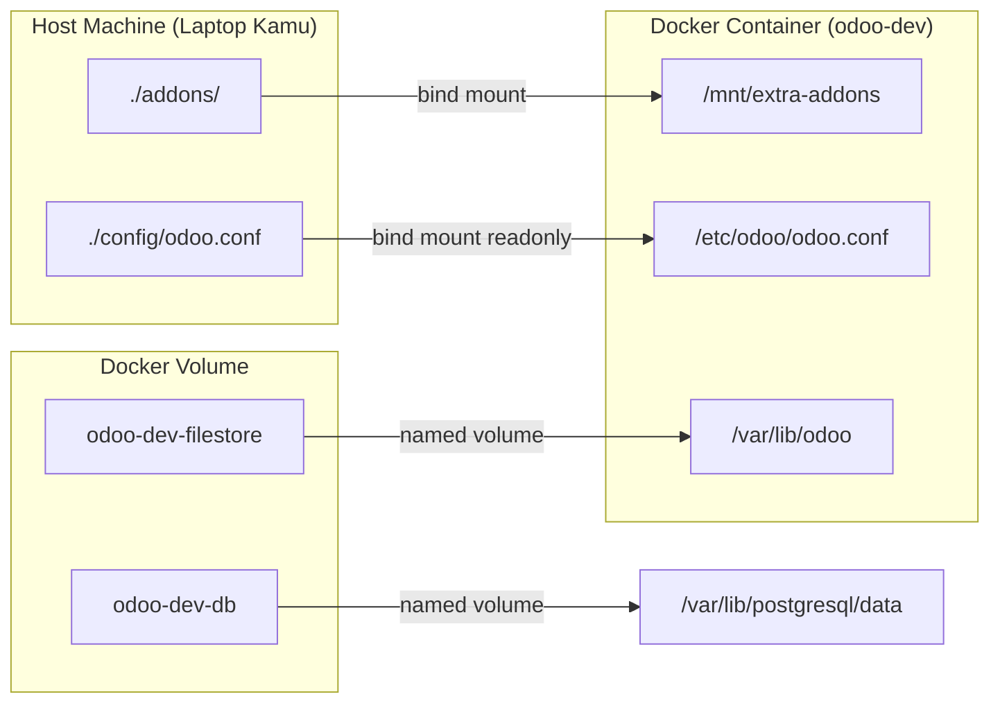
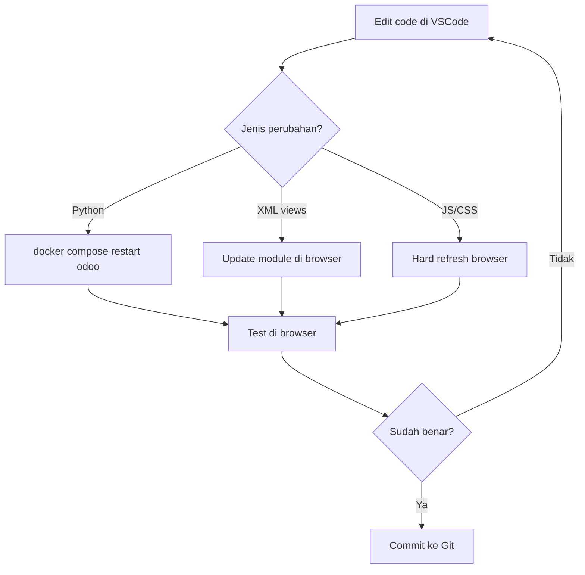

# 🐳 Panduan Lengkap: Odoo Development dengan Docker

## 1. Struktur Folder Project

```text
odoo/
├── docker-compose.yml          # Orchestrasi semua services
├── .env                        # Variabel environment (DB password, dll)
├── .gitignore                  # File yang diabaikan Git
├── config/
│   └── odoo.conf               # Konfigurasi Odoo server
└── addons/                     # ⭐ Custom modules kamu (di-mount ke container)
    ├── README.md
    └── my_first_module/        # Contoh module
        ├── __init__.py
        ├── __manifest__.py     # Metadata module
        ├── models/
        │   ├── __init__.py
        │   └── todo.py         # Business logic / model
        ├── views/
        │   └── todo_views.xml  # UI views (list, form, search)
        └── security/
            └── ir.model.access.csv  # Access control
```

> [!NOTE]
> Folder `addons/` adalah tempat semua custom module kamu. Folder ini di-mount langsung ke container sehingga perubahan kode langsung terlihat tanpa rebuild.

---

## 2. Penjelasan `docker-compose.yml`

File ini mendefinisikan 2 service:

| Service | Image | Fungsi |
|---------|-------|--------|
| `odoo` | `odoo:18.0` | Odoo web application |
| `postgres` | `postgres:16-alpine` | Database PostgreSQL |

### Port yang dibuka:
- **8069** → Odoo web interface utama
- **8072** → Live chat / longpolling

### Health Check
PostgreSQL menggunakan `pg_isready` untuk memastikan database siap sebelum Odoo mulai berjalan. Ini menghindari error "connection refused" saat startup.

---

## 3. Penjelasan Volume & Mapping

### 📦 Named Volumes (Data Persistent)

| Volume | Path di Container | Fungsi |
|--------|------------------|--------|
| `odoo-filestore` | `/var/lib/odoo` | Menyimpan file attachments, session data, filestore Odoo |
| `odoo-db-data` | `/var/lib/postgresql/data/pgdata` | Menyimpan data database PostgreSQL |

> [!IMPORTANT]
> Named volumes **bertahan** meskipun container dihapus (`docker compose down`). Data hanya hilang jika kamu secara eksplisit menghapus volume (`docker compose down -v`).

### 📂 Bind Mounts (Host ↔ Container)

| Host Path | Container Path | Mode | Fungsi |
|-----------|---------------|------|--------|
| `./addons` | `/mnt/extra-addons` | Read-Write | Custom addons — edit dari host! |
| `./config/odoo.conf` | `/etc/odoo/odoo.conf` | Read-Only | Konfigurasi Odoo |



---

## 4. Cara Menjalankan Odoo

### 🚀 Pertama Kali (Startup)

```bash
# Masuk ke folder project
cd /home/aufal/development/odoo

# Jalankan semua services (background mode)
docker compose up -d

# Lihat logs untuk memastikan berjalan normal
docker compose logs -f odoo
```

Tunggu sampai muncul log seperti:
```
odoo-dev  | 2026-05-22 ... INFO ? odoo.service.server: HTTP service (werkzeug) running on ...8069
```

Lalu buka browser: **http://localhost:8069**

### 🎯 Langkah di Browser
1. Kamu akan melihat halaman **Database Manager**
2. Isi form:
   - **Master Password**: `admin_master_pwd` (dari `odoo.conf`)
   - **Database Name**: bebas, misal `odoo_dev`
   - **Email**: email admin kamu
   - **Password**: password admin
   - **Language**: Indonesian / English
   - **Country**: Indonesia
3. Klik **Create Database** — tunggu beberapa menit

### ⚡ Perintah Sehari-hari

```bash
# Start
docker compose up -d

# Stop (data tetap aman)
docker compose down

# Restart Odoo saja (setelah edit Python code)
docker compose restart odoo

# Lihat logs real-time
docker compose logs -f odoo

# Masuk ke shell container Odoo
docker compose exec odoo bash

# Masuk ke psql database
docker compose exec postgres psql -U odoo -d odoo_dev

# Stop + HAPUS SEMUA DATA (hati-hati!)
docker compose down -v
```

---

## 5. Cara Membuat & Develop Custom Module

### Metode 1: Manual (Recommended untuk belajar)

Buat folder baru di `./addons/`:

```bash
mkdir -p addons/my_module/{models,views,security,static/description}
```

File minimum yang dibutuhkan:

```text
my_module/
├── __init__.py          # Import models
├── __manifest__.py      # Metadata module
├── models/
│   ├── __init__.py      # Import model files
│   └── my_model.py      # Business logic
├── views/
│   └── my_views.xml     # UI definition
└── security/
    └── ir.model.access.csv  # Access rights
```

### Metode 2: Menggunakan Scaffold (dari dalam container)

```bash
docker compose exec odoo odoo scaffold my_new_module /mnt/extra-addons
```

Perintah ini akan otomatis membuat struktur module lengkap di folder `./addons/my_new_module/` (terlihat langsung di host karena bind mount).

### 📦 Install Custom Module di Odoo

1. Buka **http://localhost:8069**
2. Login sebagai admin
3. Aktifkan **Developer Mode**:
   - Pergi ke **Settings** → scroll ke bawah → klik **Activate the developer mode**
4. Pergi ke **Apps** → klik **Update Apps List** (menu di atas)
5. Cari module kamu → klik **Install**

### 🔄 Setelah Edit Code

| Jenis Perubahan | Aksi |
|-----------------|------|
| Python code (models, controllers) | `docker compose restart odoo` |
| XML views | Update module di Odoo, atau restart |
| Static files (JS, CSS) | Hard refresh browser (Ctrl+Shift+R) |
| `__manifest__.py` | Update Apps List + Upgrade module |

> [!TIP]
> Untuk development aktif, uncomment baris `dev_mode` di `odoo.conf`:
> ```ini
> dev_mode = reload,qweb,xml
> ```
> Lalu restart Odoo. Ini membuat Odoo auto-reload saat ada perubahan Python/XML.

---

## 6. Host Editing vs Container Editing

### ✅ Rekomendasi: Edit dari Host (Folder yang di-mount)

| Aspek | Host Editing | Container Editing |
|-------|-------------|-------------------|
| **IDE Support** | ✅ Full VSCode, PyCharm, dll | ❌ Hanya terminal editors |
| **Git Integration** | ✅ Langsung dari project | ❌ Harus setup Git di container |
| **Data Persistence** | ✅ File tetap ada jika container dihapus | ❌ Hilang jika container di-recreate |
| **Autocomplete** | ✅ Dengan plugin Odoo | ❌ Tidak ada |
| **File Search** | ✅ Cepat (Ctrl+P, ripgrep) | ❌ Terbatas |
| **Multiple Files** | ✅ Tab editor | ❌ Satu file per terminal |
| **Debugging** | ✅ Bisa attach debugger | ⚠️ Kompleks |

> [!CAUTION]
> **Jangan edit file di dalam container** secara langsung (kecuali debugging cepat). File di dalam container yang **bukan** bagian dari bind mount akan **hilang** saat container di-recreate.

### Kapan boleh edit di container?
- Quick debugging: cek path, test satu baris
- Inspeksi file Odoo core yang bukan bagian mount kamu

---

## 7. Best Practices

### 🏗️ Project Structure
- **Satu folder per module** di `./addons/`
- Gunakan **versioning** yang konsisten: `18.0.1.0.0` (format: `odoo_version.major.minor.patch`)
- Selalu isi `__manifest__.py` dengan lengkap

### 🔒 Security
- Ganti password di `.env` untuk production
- `.env` sudah ada di `.gitignore` — jangan commit credentials
- Selalu buat `ir.model.access.csv` untuk setiap model baru

### 🐳 Docker
- Gunakan `docker compose down` (tanpa `-v`) agar data tetap aman
- Backup database secara berkala:
  ```bash
  # Backup
  docker compose exec postgres pg_dump -U odoo odoo_dev > backup_$(date +%Y%m%d).sql
  
  # Restore
  cat backup_20260522.sql | docker compose exec -T postgres psql -U odoo odoo_dev
  ```

### 📝 Development Workflow


### 📚 Belajar Selanjutnya
1. **Odoo ORM** — Pelajari fields, methods, dan decorators (`@api.depends`, `@api.onchange`)
2. **Inheritance** — Extend module yang sudah ada tanpa mengubah source aslinya
3. **Web Controllers** — Buat REST API atau custom web pages
4. **Reports** — Generate PDF reports dengan QWeb templates
5. **Security** — Record rules dan access groups

> [!TIP]
> Sample module `my_first_module` yang sudah dibuat berisi contoh **model** (Todo Task), **views** (list, form, search), dan **security** (access rights). Install dan pelajari sebagai starting point!

---

## Quick Reference Card

| Perintah | Fungsi |
|----------|--------|
| `docker compose up -d` | Start Odoo + PostgreSQL |
| `docker compose down` | Stop (data aman) |
| `docker compose down -v` | Stop + hapus semua data ⚠️ |
| `docker compose restart odoo` | Restart Odoo setelah edit Python |
| `docker compose logs -f odoo` | Lihat logs real-time |
| `docker compose exec odoo bash` | Masuk shell container |
| `docker compose exec odoo odoo scaffold <name> /mnt/extra-addons` | Generate module baru |
| `http://localhost:8069` | Buka Odoo di browser |
| `http://localhost:8069/web/database/manager` | Database manager |
