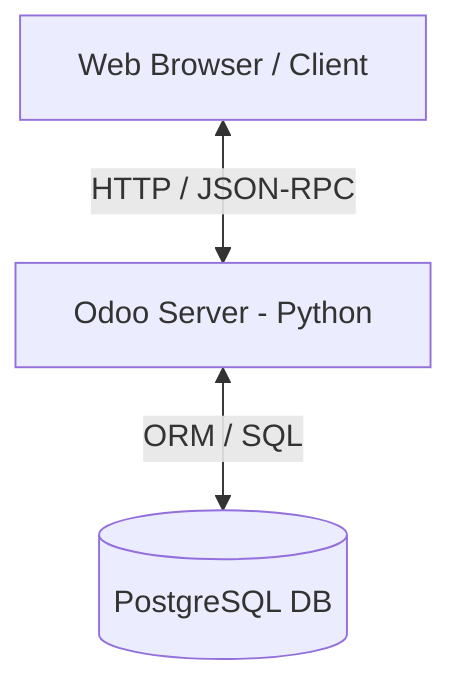

# 📘 Odoo Development Handbook & Cheatsheet (Bahasa Indonesia)

Buku panduan dan referensi cepat ini dirancang untuk membantu Anda menguasai pengembangan modul kustom di Odoo 18 menggunakan Docker. Ditulis dengan pendekatan praktis untuk pemula hingga tingkat lanjut.

---

## 1. Pengenalan Odoo

### Apa itu Odoo?
Odoo adalah rangkaian aplikasi bisnis sumber terbuka (*open-source*) terintegrasi yang mencakup modul ERP (*Enterprise Resource Planning*), CRM, Akuntansi, Manufaktur, Penjualan, Inventaris, hingga pembuatan Website dan E-commerce. Keunggulan utamanya adalah modularitas: semua aplikasi saling terhubung dan berbagi satu database terpusat.

### Arsitektur Odoo
Odoo menggunakan arsitektur **Tiga Lapis (Three-Tier Architecture)**:
1. **Presentation Tier (Frontend)**: Berbasis web menggunakan HTML5, CSS3, JavaScript (menggunakan framework Odoo OWL - *Odoo Web Library*).
2. **Application Tier (Backend)**: Ditulis menggunakan bahasa pemrograman Python. Bertanggung jawab atas logika bisnis, pemrosesan data, dan komunikasi ORM.
3. **Data Tier (Database)**: Menggunakan PostgreSQL untuk menyimpan seluruh data relasional bisnis.



### Cara Kerja Odoo secara Umum
Ketika pengguna melakukan interaksi (misalnya klik tombol simpan pada form):
1. Browser mengirimkan request XML-RPC atau JSON-RPC ke server Odoo.
2. Routing controller Odoo mengarahkan request tersebut ke method Python yang sesuai di model.
3. Logika Python memproses data menggunakan ORM.
4. ORM menerjemahkan query Python ke SQL dan mengirimkannya ke PostgreSQL.
5. Database mengembalikan hasil, ORM membungkusnya menjadi objek Python, dan Odoo me-render UI (biasanya dalam bentuk XML yang dikonversi ke HTML) untuk dikembalikan ke browser.

### Perbedaan Community vs Enterprise
* **Odoo Community (CE)**: Versi gratis berlisensi LGPL-3. Memiliki fitur dasar CRM, Sales, Purchase, Project, Inventory, dan Website.
* **Odoo Enterprise (EE)**: Versi berbayar/lisensi komersial. Menyediakan modul lanjutan seperti Accounting lengkap, Payroll, PLM, Studio, IoT, barcode integration, UI/UX yang lebih modern (mobile responsive), serta dukungan teknis resmi.

### Konsep Modular di Odoo
Di Odoo, setiap fitur adalah **Addon Module**. Pengembangan Odoo tidak dilakukan dengan mengubah source code inti (*Odoo Core*), melainkan dengan **mewarisi (inheriting)** atau membuat modul baru yang menimpa/menambah perilaku modul bawaan. Pendekatan ini membuat upgrade versi Odoo menjadi jauh lebih mudah dan aman.

---

## 2. Istilah Penting di Odoo (Cheatsheet)

| Istilah | Definisi & Fungsi | Kapan Digunakan | Contoh Sederhana |
|---------|------------------|-----------------|------------------|
| **Model** | Representasi tabel database dalam bentuk kelas Python (`models.Model`). | Saat ingin menyimpan struktur data baru (misal: data karyawan, data tugas). | `class ResPartner(models.Model):` |
| **ORM** | *Object-Relational Mapping*. Penghubung kode Python dengan database SQL tanpa menulis SQL manual. | Setiap kali melakukan operasi CRUD (Create, Read, Update, Delete) pada data. | `self.env['res.partner'].create({'name': 'Budi'})` |
| **Recordset** | Kumpulan baris data (records) dari suatu Model yang dibungkus dalam objek Python. | Saat memanipulasi atau mengambil data dari database. | `partners = self.env['res.partner'].search([])` |
| **Environment (`env`)** | Konteks eksekusi Odoo yang menyimpan informasi user aktif, bahasa, database cursor, dan registri model. | Saat ingin memanggil model lain atau mengetahui user yang sedang login. | `self.env.user` (mengambil user aktif) |
| **Domain** | Kriteria pencarian atau filter data menggunakan list tuple python. | Saat melakukan filter data di Python (`search`) atau filter di XML view. | `[('is_done', '=', False), ('priority', '=', '3')]` |
| **Context** | Dictionary data meta yang dikirimkan bersama request untuk mengatur perilaku tampilan atau logika. | Saat meneruskan nilai default ke form baru atau mengubah bahasa tampilan secara dinamis. | `{'default_user_id': self.env.uid}` |
| **Action** | Trigger di Odoo untuk membuka view tertentu, menjalankan server action, atau mendownload file. | Saat pengguna mengklik menu atau menekan tombol di UI. | `<record id="action_todo" model="ir.actions.act_window">` |
| **View** | Representasi visual dari data model ke pengguna. | Untuk mengatur layout halaman (form, list/tree, kanban, search). | `<form string="Task"> ... </form>` |
| **XML View** | File format XML yang digunakan untuk mendefinisikan layout UI di Odoo. | Untuk membuat tampilan aplikasi baru atau memodifikasi tampilan bawaan. | `<field name="arch" type="xml">` |
| **QWeb** | Template engine berbasis XML milik Odoo untuk menghasilkan HTML dinamis dan PDF. | Saat membuat PDF report atau halaman website kustom. | `<t t-esc="record.name"/>` |
| **Controller** | Handler request HTTP luar (seperti router di Flask/Express) berbasis kelas `http.Controller`. | Saat membuat REST API endpoint, integrasi webhook, atau halaman web custom. | `@http.route('/api/tasks', type='json', auth='public')` |
| **Wizard** | Form interaktif sementara yang digunakan untuk meminta input cepat dari user. | Saat ingin memproses tindakan massal (misal: "Batal Massal", "Cetak Invoice Terpilih"). | Mewarisi dari `models.TransientModel` |
| **TransientModel** | Model sementara yang datanya akan otomatis dihapus secara berkala oleh cron Odoo. | Sebagai basis data wizard untuk menampung input sementara user. | `class CancelWizard(models.TransientModel):` |
| **Inheritance** | Mekanisme mewarisi model (`_inherit`) atau view (`xpath`) untuk memodifikasi fungsi yang sudah ada. | Saat ingin menambahkan field baru ke tabel bawaan Odoo (misal: menambah field NIK ke tabel Customer). | `_inherit = 'res.partner'` |
| **Computed Field** | Field yang nilainya dihitung secara dinamis lewat fungsi Python, bukan input manual. | Untuk field kalkulasi seperti "Total Harga = Jumlah x Harga Satuan". | `total = fields.Float(compute='_compute_total')` |
| **Related Field** | Field pintas yang menampilkan nilai field dari model lain yang terelasi. | Untuk menampilkan alamat customer langsung di dalam form penjualan. | `email = fields.Char(related='partner_id.email')` |
| **Security Group** | Pengelompokan peran user (misal: Salesman, Sales Manager) untuk membatasi akses fitur. | Saat membatasi agar hanya Manager yang bisa menyetujui invoice. | `<record id="group_manager" model="res.groups">` |
| **ACL (Access Control List)** | Tabel izin CRUD dasar tingkat model (`ir.model.access.csv`). | Selalu dibuat setiap kali mendefinisikan model baru agar model dapat diakses user. | `access_todo_task,todo.task,...,1,1,1,1` |
| **Record Rule** | Aturan keamanan baris data (*Row-Level Security*) menggunakan domain. | Saat membatasi agar "Salesman hanya bisa melihat data prospek miliknya sendiri". | `[('user_id', '=', user.id)]` |
| **Menuitem** | Link navigasi di sidebar atau top bar Odoo. | Untuk mendaftarkan menu klik aplikasi di sidebar kiri/atas. | `<menuitem id="menu_task" action="action_todo"/>` |
| **Server Action** | Tindakan otomatis di backend yang bisa dipicu lewat UI atau automasi lainnya. | Saat ingin membuat tombol aksi massal di menu action list view. | `model="ir.actions.server"` |
| **Cron Job** | Penjadwal tugas otomatis latar belakang yang berjalan berkala. | Untuk mengirim email pengingat harian secara otomatis setiap jam 8 pagi. | `model="ir.cron"` |
| **RPC** | *Remote Procedure Call*. Protokol komunikasi data client-server (Odoo menggunakan JSON-RPC). | Saat aplikasi luar atau frontend JS berinteraksi dengan server Odoo. | `this.env.services.rpc(...)` |
| **External API** | Endpoint Odoo yang dapat diakses oleh aplikasi luar menggunakan XML-RPC. | Saat mengintegrasikan Odoo dengan software eksternal seperti website toko online lain. | Menggunakan library Python `xmlrpc.client` |
| **Multi-company** | Fitur Odoo untuk menjalankan beberapa entitas bisnis dalam satu database terpusat. | Saat perusahaan induk mengelola banyak anak perusahaan dengan laporan keuangan terpisah. | `company_id = fields.Many2one('res.company')` |

---

## 3. File Penting, Penamaan File, dan Struktur Modul

Bagian ini menjelaskan file yang paling sering dipakai saat membuat modul Odoo, serta cara memahami nama-nama file dan fungsinya.

### File Paling Penting di Modul Odoo

#### `__manifest__.py`
File metadata modul. Isinya menentukan nama modul, versi, dependensi, dan file apa saja yang harus diload Odoo.

Hal penting di dalamnya:
- `name`: nama modul
- `version`: versi modul
- `depends`: modul lain yang wajib ada
- `data`: file XML/CSV yang dimuat saat install/update
- `application`: menentukan apakah modul tampil sebagai aplikasi

#### `__init__.py`
File loader Python. Tanpa ini, folder Python tidak dianggap sebagai package.

Biasanya dipakai untuk:
- load `models`
- load `controllers`
- load `wizard`

#### `models/`
Folder untuk logic backend dan definisi model.

Umumnya berisi:
- class model (`models.Model`)
- field
- method bisnis
- compute field

#### `views/`
Folder untuk XML UI.

Biasanya berisi:
- form view
- list/tree view
- search view
- action
- menu

#### `security/`
Folder untuk aturan keamanan.

Biasanya berisi:
- `ir.model.access.csv`
- record rules
- group security

#### `static/`
Folder aset frontend.

Biasanya berisi:
- icon modul
- CSS/SCSS
- JavaScript
- template OWL/QWeb

#### `data/`
Folder data awal sistem.

Biasanya berisi:
- sequence
- cron
- template email
- data default

---

### Arti Nama File yang Sering Dipakai

- `__manifest__.py` → file identitas dan konfigurasi modul
- `__init__.py` → file pengenal package Python
- `models/*.py` → file Python untuk model dan logika bisnis
- `views/*.xml` → file XML untuk tampilan menu, form, list, action
- `security/ir.model.access.csv` → hak akses CRUD per model
- `static/description/` → icon dan gambar modul di halaman Apps
- `demo/*.xml` → data contoh untuk demo

---

### Istilah Nama yang Wajib Dipahami

#### `name`
Label yang terlihat oleh user.

Contoh:
```xml
<menuitem name="Testing Bang" id="testing_bang.menu_root"/>
```

#### `id`
Nama teknis unik untuk record XML.

Contoh:
```xml
<record id="action_testing_bang" model="ir.actions.act_window">
```

#### `parent`
Menentukan menu induk.

Contoh:
```xml
<menuitem name="Menu 1" parent="testing_bang.menu_root"/>
```

#### `action`
Menentukan action yang dijalankan saat menu diklik.

Contoh:
```xml
<menuitem action="action_testing_bang"/>
```

#### XML ID / External ID
Nama referensi unik yang dipakai Odoo untuk memanggil data XML.

Contoh:
```xml
<record id="action_testing_bang" model="ir.actions.act_window">
```

Lalu bisa dipanggil dari menu dengan:
```xml
action="action_testing_bang"
```

---

### Hubungan Antara File Penting

Alur paling umum di Odoo:

1. Model dibuat di `models/*.py`
2. View dan action dibuat di `views/*.xml`
3. Menu diarahkan ke action
4. Security diatur di `security/ir.model.access.csv`
5. Semua file didaftarkan di `__manifest__.py`
6. Modul di-upgrade supaya perubahan terbaca Odoo

Contoh singkat:
- `models/todo.py` → buat model `todo.task`
- `views/todo_views.xml` → buat form/list/action/menu
- `security/ir.model.access.csv` → kasih hak akses user
- `__manifest__.py` → load semua file tadi

---

## 3. Struktur Project Odoo

Struktur project Odoo harus mengikuti standar konvensi agar mudah dibaca dan dimaintain.

```text
my_project/
│
├── config/
│   └── odoo.conf                   # File konfigurasi Odoo Server
│
├── addons/                         # Tempat custom addons diletakkan
│   └── custom_sales_addon/         # Contoh modul kustom
│       ├── __init__.py             # Entrypoint Python modul
│       ├── __manifest__.py         # Metadata, dependensi, dan deklarasi XML
│       │
│       ├── models/                 # 1. Definisi Tabel Database & Logika Bisnis
│       │   ├── __init__.py
│       │   ├── sale_order.py       # Warisan model Odoo core
│       │   └── custom_record.py    # Model baru buatan sendiri
│       │
│       ├── views/                  # 2. Desain Tampilan UI (XML)
│       │   ├── sale_order_views.xml
│       │   ├── custom_record_views.xml
│       │   └── menus.xml           # Definisi menu dan action window
│       │
│       ├── security/               # 3. Pengaturan Hak Akses
│       │   ├── ir.model.access.csv # Izin CRUD dasar model
│       │   └── security_rules.xml  # Group & Record Rules
│       │
│       ├── data/                   # 4. Data Master / Parameter Awal
│       │   └── sequence_data.xml   # Penomoran otomatis, data awal
│       │
│       ├── wizard/                 # 5. Form Sementara / Dialog Box
│       │   ├── __init__.py
│       │   ├── print_report_wizard.py
│       │   └── print_report_wizard_views.xml
│       │
│       ├── controllers/            # 6. Web Controller (Routing HTTP / API)
│       │   ├── __init__.py
│       │   └── main.py
│       │
│       ├── report/                 # 7. QWeb PDF Report Template
│       │   ├── custom_report_templates.xml
│       │   └── custom_reports.xml  # Pendaftaran template report ke sistem
│       │
│       └── static/                 # 8. Aset Frontend
│           ├── description/
│           │   └── icon.png        # Icon aplikasi yang tampil di dashboard Apps
│           ├── src/
│           │   ├── js/             # Kustom JavaScript
│           │   ├── css/            # Kustom CSS/SCSS
│           │   └── xml/            # Template OWL XML
```

---

## 4. Setup Development Environment

Cara paling modern dan bersih untuk memulai development Odoo adalah menggunakan Docker Compose.

### Docker Compose Setup
Buat file `docker-compose.yml` di root directory Anda:

```yaml
services:
  odoo:
    image: odoo:18.0
    container_name: odoo-dev
    env_file: .env
    depends_on:
      postgres:
        condition: service_healthy
    ports:
      - "8069:8069"
      - "8072:8072"
    volumes:
      - odoo-filestore:/var/lib/odoo
      - ./addons:/mnt/extra-addons
      - ./config/odoo.conf:/etc/odoo/odoo.conf:ro
    restart: unless-stopped
    tty: true

  postgres:
    image: postgres:16-alpine
    container_name: odoo-db
    env_file: .env
    volumes:
      - odoo-db-data:/var/lib/postgresql/data/pgdata
    restart: unless-stopped
    healthcheck:
      test: ["CMD-SHELL", "pg_isready -U odoo -d postgres"]
      interval: 10s
      timeout: 5s
      retries: 5

volumes:
  odoo-filestore:
  odoo-db-data:
```

Buat file `.env` di direktori yang sama:
```ini
POSTGRES_DB=postgres
POSTGRES_USER=odoo
POSTGRES_PASSWORD=odoo_dev_password
PGDATA=/var/lib/postgresql/data/pgdata

HOST=postgres
USER=odoo
PASSWORD=odoo_dev_password
```

Buat file konfigurasi Odoo di `./config/odoo.conf`:
```ini
[options]
db_host = postgres
db_port = 5432
db_user = odoo
db_password = odoo_dev_password
db_name = False
addons_path = /mnt/extra-addons
data_dir = /var/lib/odoo
log_level = info
workers = 0
; Aktifkan auto reload file xml/python selama development
dev_mode = reload,qweb,xml
```

### Rekomendasi Ekstensi VSCode
Untuk mempermudah penulisan kode, install ekstensi berikut:
1. **Python** (Official Microsoft) - Autocomplete dan debugging Python.
2. **Odoo IDE** atau **Odoo Snippets** - Membantu auto-complete kode XML dan Python Odoo.
3. **XML Tools** - Format dan validasi file XML.

---

## 5. Dasar Development Module Odoo

Mari kita buat modul sederhana bernama `simple_crm`.

### Langkah 1: Buat Struktur File
Buat folder dan file seperti ini:
```text
addons/simple_crm/
├── __init__.py
├── __manifest__.py
├── models/
│   ├── __init__.py
│   └── lead.py
├── views/
│   └── lead_views.xml
└── security/
    └── ir.model.access.csv
```

### Langkah 2: Isi File `__manifest__.py`
File manifest menyimpan deskripsi modul Anda.

```python
# -*- coding: utf-8 -*-
{
    'name': 'Simple CRM',
    'version': '18.0.1.0.0',
    'summary': 'Kelola Leads dan Pelanggan Sederhana',
    'author': 'Aufal',
    'category': 'Sales',
    'depends': ['base'],
    'data': [
        'security/ir.model.access.csv',
        'views/lead_views.xml',
    ],
    'installable': True,
    'application': True,
    'license': 'LGPL-3',
}
```

### Langkah 3: Isi File `__init__.py`
Di root modul (`addons/simple_crm/__init__.py`):
```python
from . import models
```
Di dalam folder models (`addons/simple_crm/models/__init__.py`):
```python
from . import lead
```

### Langkah 4: Buat Model di `models/lead.py`
```python
from odoo import models, fields, api

class CrmLead(models.Model):
    _name = 'simple.crm.lead'
    _description = 'Lead Prospek Pelanggan'

    name = fields.Char(string='Nama Prospek', required=True)
    contact_name = fields.Char(string='Nama Kontak')
    email = fields.Char(string='Email')
    phone = fields.Char(string='Nomor Telepon')
    value = fields.Float(string='Estimasi Nilai Proyek')
    status = fields.Selection([
        ('new', 'Baru'),
        ('qualified', 'Kualifikasi'),
        ('won', 'Berhasil'),
        ('lost', 'Gagal')
    ], string='Status', default='new')
    notes = fields.Text(string='Catatan')
```

### Langkah 5: Buat View UI di `views/lead_views.xml`
```xml
<?xml version="1.0" encoding="utf-8"?>
<odoo>
    <!-- Tree/List View -->
    <record id="view_simple_crm_lead_tree" model="ir.ui.view">
        <field name="name">simple.crm.lead.tree</field>
        <field name="model">simple.crm.lead</field>
        <field name="arch" type="xml">
            <list string="Daftar Prospek">
                <field name="name"/>
                <field name="contact_name"/>
                <field name="email"/>
                <field name="value" sum="Total Estimasi"/>
                <field name="status" widget="badge" decoration-info="status == 'new'" decoration-success="status == 'won'"/>
            </list>
        </field>
    </record>

    <!-- Form View -->
    <record id="view_simple_crm_lead_form" model="ir.ui.view">
        <field name="name">simple.crm.lead.form</field>
        <field name="model">simple.crm.lead</field>
        <field name="arch" type="xml">
            <form string="Form Prospek">
                <header>
                    <field name="status" widget="statusbar" options="{'clickable': '1'}"/>
                </header>
                <sheet>
                    <div class="oe_title">
                        <label for="name" class="oe_edit_only"/>
                        <h1><field name="name" placeholder="Contoh: Pengadaan Server BUMN"/></h1>
                    </div>
                    <group>
                        <group string="Informasi Kontak">
                            <field name="contact_name"/>
                            <field name="phone"/>
                            <field name="email"/>
                        </group>
                        <group string="Detail Finansial">
                            <field name="value"/>
                        </group>
                    </group>
                    <notebook>
                        <page string="Deskripsi &amp; Catatan">
                            <field name="notes" placeholder="Tulis catatan prospek di sini..."/>
                        </page>
                    </notebook>
                </sheet>
            </form>
        </field>
    </record>

    <!-- Window Action -->
    <record id="action_simple_crm_lead" model="ir.actions.act_window">
        <field name="name">Prospek CRM</field>
        <field name="res_model">simple.crm.lead</field>
        <field name="view_mode">list,form</field>
        <field name="help" type="html">
            <p class="o_view_nocontent_smiling_face">Buat data prospek pertama Anda!</p>
        </field>
    </record>

    <!-- Menu Items -->
    <menuitem id="menu_simple_crm_root" name="Simple CRM" sequence="15"/>
    <menuitem id="menu_simple_crm_lead" name="Prospek" parent="menu_simple_crm_root" action="action_simple_crm_lead" sequence="10"/>
</odoo>
```

### Langkah 6: Tambah Hak Akses di `security/ir.model.access.csv`
```csv
id,name,model_id:id,group_id:id,perm_read,perm_write,perm_create,perm_unlink
access_simple_crm_lead,access_simple_crm_lead,model_simple_crm_lead,base.group_user,1,1,1,1
```

### Langkah 7: Jalankan Odoo & Install Modul
1. Start docker: `docker compose up -d`
2. Buka Odoo web (`http://localhost:8069`), selesaikan database wizard.
3. Aktifkan **Developer Mode** di Settings.
4. Masuk ke menu **Apps** → Klik **Update Apps List** di navigasi atas.
5. Cari `Simple CRM`, hapus filter default `Apps` jika modul tidak muncul.
6. Klik **Activate/Install**.

---

## 6. ORM Odoo

ORM (Object-Relational Mapping) Odoo menyediakan method python terintegrasi untuk mengolah data tanpa SQL.

### Operasi CRUD Dasar & Search

```python
# 1. SEARCH: Mengambil recordset berdasarkan filter domain
# Mencari semua lead berstatus 'won'
leads = self.env['simple.crm.lead'].search([('status', '=', 'won')])

# 2. CREATE: Membuat data baru di database (menerima dictionary)
new_lead = self.env['simple.crm.lead'].create({
    'name': 'Kemitraan PT Maju Jaya',
    'contact_name': 'Rian',
    'value': 150000000.0,
})

# 3. WRITE: Mengupdate data yang ada (menerima dictionary)
# new_lead adalah recordset
new_lead.write({
    'status': 'qualified',
    'phone': '08123456789'
})

# 4. BROWSE: Mengambil recordset berdasarkan daftar ID
# Cepat karena mengambil data langsung dari memori jika sudah di-cache
lead_by_id = self.env['simple.crm.lead'].browse(1)

# 5. UNLINK: Menghapus record dari database
# Menghapus lead yang gagal
failed_leads = self.env['simple.crm.lead'].search([('status', '=', 'lost')])
failed_leads.unlink()
```

### Manipulasi Recordset

```python
# MAPPED: Mengambil list nilai dari field tertentu secara cepat
emails = leads.mapped('email')  # Hasil: ['budi@mail.com', 'wati@mail.com']

# FILTERED: Memfilter recordset menggunakan fungsi Python
high_value_leads = leads.filtered(lambda r: r.value > 100000000)

# SORTED: Mengurutkan recordset berdasarkan kriteria tertentu
sorted_leads = leads.sorted(key=lambda r: r.value, reverse=True)

# SUDO: Bypass semua aturan hak akses keamanan (berjalan sebagai Superuser/System)
all_leads_system = self.env['simple.crm.lead'].sudo().search([])

# ENSURE_ONE: Memastikan recordset hanya berisi tepat satu record. Jika kosong atau > 1, memicu error.
self.ensure_one()
print(self.name)
```

### Deklarator & Compute Logika

#### `@api.depends`
Digunakan untuk menghitung nilai field secara dinamis berdasarkan field inputan lainnya.

```python
tax_amount = fields.Float(compute='_compute_tax_amount', store=True)
price = fields.Float(string='Harga')

@api.depends('price')
def _compute_tax_amount(self):
    for record in self:
        # Menghitung PPN 11%
        record.tax_amount = record.price * 0.11
```
*Catatan*: Gunakan `store=True` agar nilai hasil kalkulasi disimpan di database, sehingga field bisa disearch dan disortir.

#### `@api.onchange`
Digunakan untuk mengubah nilai field di form secara interaktif sebelum data disimpan (berjalan di sisi frontend browser).

```python
partner_id = fields.Many2one('res.partner', string='Pelanggan')
email = fields.Char(string='Email')

@api.onchange('partner_id')
def _onchange_partner_id(self):
    if self.partner_id:
        # Isi otomatis field email saat pelanggan dipilih
        self.email = self.partner_id.email
```

#### `@api.constrains`
Digunakan untuk validasi data tingkat database (*Database Validation*).

```python
from odoo.exceptions import ValidationError

value = fields.Float(string='Estimasi Nilai')

@api.constrains('value')
def _check_value(self):
    for record in self:
        if record.value < 0:
            raise ValidationError("Estimasi nilai proyek tidak boleh negatif!")
```

---

## 7. Relasi Database

Odoo memiliki 3 tipe field relasi untuk menghubungkan tabel database.

### 1. Many2one
Menghubungkan record aktif ke **satu** record pada model target (sebagai *Foreign Key* di SQL).

```python
# Model: simple.crm.lead
# Satu lead ditugaskan ke satu Salesperson (User Odoo)
salesperson_id = fields.Many2one(
    comodel_name='res.users',
    string='Salesperson',
    default=lambda self: self.env.user,
    ondelete='set null' # Aksi jika model target dihapus: set null / cascade / restrict
)
```

### 2. One2many
Menghubungkan record aktif ke **banyak** record pada model target. Membutuhkan field `Many2one` terbalik di model target.

```python
# Model: simple.crm.lead
# Satu lead bisa memiliki banyak aktivitas log (lead.activity)
activity_ids = fields.One2many(
    comodel_name='simple.crm.lead.activity',
    inverse_name='lead_id', # nama field Many2one di model target
    string='Aktivitas'
)
```

### 3. Many2many
Hubungan **banyak-ke-banyak**. Odoo secara otomatis membuat tabel perantara (*relation table*) di database.

```python
# Model: simple.crm.lead
# Satu lead bisa memiliki banyak tag, dan satu tag bisa menempel di banyak lead
tag_ids = fields.Many2many(
    comodel_name='simple.crm.lead.tag',
    relation='crm_lead_tag_rel',    # nama tabel perantara di database
    column1='lead_id',              # foreign key model ini di tabel perantara
    column2='tag_id',               # foreign key model target di tabel perantara
    string='Tags'
)
```

---

## 8. Security di Odoo

Keamanan data di Odoo dikontrol lewat tiga lapis: Menu/Views, ACL (Model Level), dan Record Rules (Row Level).

### 1. Hak Akses Model (ACL) - `ir.model.access.csv`
Mendefinisikan hak akses CRUD paling dasar per Model untuk setiap Security Group.
Format kolom:
`id, name, model_id:id, group_id:id, perm_read, perm_write, perm_create, perm_unlink`

* Contoh:
```csv
id,name,model_id:id,group_id:id,perm_read,perm_write,perm_create,perm_unlink
access_lead_user,lead.user,model_simple_crm_lead,base.group_user,1,1,1,0
access_lead_manager,lead.manager,model_simple_crm_lead,simple_crm.group_crm_manager,1,1,1,1
```
*Penjelasan*: User biasa (`group_user`) bisa melihat, mengedit, membuat lead, tapi **tidak bisa** menghapus (`perm_unlink` = 0). Sedangkan Manager (`group_crm_manager`) memiliki hak akses penuh (`1,1,1,1`).

### 2. Security Group (`security_rules.xml`)
Digunakan untuk mengelompokkan kategori hak akses pengguna.

```xml
<odoo>
    <data noupdate="1">
        <!-- Kategori Aplikasi -->
        <record id="module_category_simple_crm" model="ir.module.category">
            <field name="name">Simple CRM</field>
            <field name="description">Kategori akses untuk Simple CRM</field>
        </record>

        <!-- Group Manager CRM -->
        <record id="group_crm_manager" model="res.groups">
            <field name="name">Manager</field>
            <field name="category_id" ref="module_category_simple_crm"/>
            <!-- Manager otomatis mewarisi semua akses user biasa -->
            <field name="implied_ids" eval="[(4, ref('base.group_user'))]"/>
        </record>
    </data>
</odoo>
```

### 3. Record Rules (`security_rules.xml`)
Membatasi akses baris data (*row-level data access*) menggunakan kriteria domain.

```xml
<record id="rule_personal_leads" model="ir.rule">
    <field name="name">Personal Leads Only</field>
    <field name="model_id" ref="model_simple_crm_lead"/>
    <!-- Anggota Group User biasa hanya bisa melihat lead miliknya sendiri -->
    <field name="groups" eval="[(4, ref('base.group_user'))]"/>
    <field name="domain_force">[('create_uid', '=', user.id)]</field>
</record>
```

---

## 9. View & XML

UI Odoo didefinisikan secara deklaratif menggunakan kode XML.

### Tampilan Notebook dan Tab di Form View
```xml
<sheet>
    <group>
        <field name="name"/>
    </group>
    <!-- Notebook membagi konten form menjadi beberapa tab -->
    <notebook>
        <page string="General Info" name="general_info">
            <group>
                <field name="email"/>
                <field name="phone"/>
            </group>
        </page>
        <page string="Internal Notes" name="internal_notes">
            <field name="notes" placeholder="Ketik deskripsi internal di sini..."/>
        </page>
    </notebook>
</sheet>
```

### Search View
Digunakan untuk mendefinisikan kolom pencarian cepat, tombol filter, dan opsi pengelompokan (*Group By*) data.

```xml
<record id="view_simple_crm_lead_search" model="ir.ui.view">
    <field name="name">simple.crm.lead.search</field>
    <field name="model">simple.crm.lead</field>
    <field name="arch" type="xml">
        <search string="Cari Prospek">
            <!-- Kolom yang dapat dicari textnya -->
            <field name="name" string="Prospek"/>
            <field name="contact_name"/>
            <!-- Filter cepat -->
            <filter string="Baru" name="filter_new" domain="[('status', '=', 'new')]"/>
            <filter string="Berhasil (Won)" name="filter_won" domain="[('status', '=', 'won')]"/>
            <separator/>
            <!-- Group by -->
            <group expand="0" string="Group By">
                <filter string="Status" name="group_status" context="{'group_by': 'status'}"/>
            </group>
        </search>
    </field>
</record>
```

### XPath & View Inheritance
Mekanisme memodifikasi view bawaan Odoo tanpa mengubah file aslinya.

```xml
<record id="view_partner_form_inherit" model="ir.ui.view">
    <field name="name">res.partner.form.inherit</field>
    <field name="model">res.partner</field>
    <field name="inherit_id" ref="base.view_partner_form"/>
    <field name="arch" type="xml">
        <!-- Menyisipkan field baru setelah field website pada form partner bawaan -->
        <xpath expr="//field[@name='website']" position="after">
            <field name="custom_nik" placeholder="Nomor Induk Kependudukan"/>
        </xpath>
    </field>
</record>
```

**Pilihan Posisi XPath (`position`):**
* `after`: Menyisipkan elemen setelah target.
* `before`: Menyisipkan elemen sebelum target.
* `inside`: Memasukkan elemen ke bagian dalam target paling bawah.
* `replace`: Menggantikan elemen target sepenuhnya.
* `attributes`: Mengubah atribut elemen target (misal membuat field menjadi `required="1"` atau `readonly="1"`).

---

## 10. Advanced Development

### 1. Wizard (`models.TransientModel`)
Form dinamis yang muncul sebagai modal pop-up untuk memproses aksi tertentu.

#### Wizard Python (`wizard/lost_reason_wizard.py`):
```python
from odoo import models, fields, api

class LostReasonWizard(models.TransientModel):
    _name = 'crm.lost.reason.wizard'
    _description = 'Wizard Alasan Gagal'

    reason = fields.Text(string='Alasan Gagal', required=True)

    def action_confirm_lost(self):
        # Mengambil active ID (ID lead tempat wizard ini dibuka)
        active_id = self.env.context.get('active_id')
        lead = self.env['simple.crm.lead'].browse(active_id)
        # Tulis alasan gagal dan ubah status lead
        lead.write({
            'status': 'lost',
            'notes': f"Alasan Gagal: {self.reason}\n\n" + (lead.notes or '')
        })
        return {'type': 'ir.actions.act_window_close'}
```

#### Wizard XML (`wizard/lost_reason_wizard_views.xml`):
```xml
<record id="view_lost_reason_wizard_form" model="ir.ui.view">
    <field name="name">crm.lost.reason.wizard.form</field>
    <field name="model">crm.lost.reason.wizard</field>
    <field name="arch" type="xml">
        <form string="Konfirmasi Gagal">
            <group>
                <field name="reason"/>
            </group>
            <footer>
                <button name="action_confirm_lost" string="Simpan &amp; Tutup" type="object" class="btn-primary"/>
                <button string="Batal" class="btn-secondary" special="cancel"/>
            </footer>
        </form>
    </field>
</record>
```

### 2. Scheduled Action (Cron Job)
Tugas latar belakang terjadwal otomatis. Didefinisikan dalam data XML (`data/cron_data.xml`).

```xml
<odoo>
    <data noupdate="1">
        <record id="ir_cron_check_stale_leads" model="ir.cron">
            <field name="name">CRM: Bersihkan Prospek Usang</field>
            <field name="model_id" ref="model_simple_crm_lead"/>
            <field name="state">code</field>
            <!-- Memanggil method di model lead -->
            <field name="code">model._cron_check_stale_leads()</field>
            <field name="interval_number">1</field>
            <field name="interval_type">days</field> <!-- Jam, Hari, Minggu, Bulan -->
            <field name="numbercall">-1</field> <!-- -1 artinya berjalan tanpa batas -->
            <field name="active" eval="True"/>
        </record>
    </data>
</odoo>
```

Di Python model (`models/lead.py`):
```python
@api.model
def _cron_check_stale_leads(self):
    # Cari lead baru yang sudah tidak diedit selama 30 hari, lalu otomatis statusnya gagal
    stale_leads = self.search([
        ('status', '=', 'new'),
        ('write_date', '<', fields.Datetime.now() - datetime.timedelta(days=30))
    ])
    stale_leads.write({'status': 'lost', 'notes': 'Ditutup otomatis oleh sistem karena tidak aktif 30 hari.'})
```

### 3. Web Controller (Routing & REST API)
Membuat API Endpoint kustom yang dapat diakses oleh luar.

```python
from odoo import http
from odoo.http import request

class SimpleCrmController(http.Controller):

    # Endpoint JSON-RPC / REST API
    # Membaca daftar lead berstatus sukses
    @http.route('/api/v1/leads/won', type='json', auth='public', methods=['GET'])
    def get_won_leads(self):
        leads = request.env['simple.crm.lead'].sudo().search([('status', '=', 'won')])
        data = []
        for lead in leads:
            data.append({
                'id': lead.id,
                'name': lead.name,
                'value': lead.value,
                'contact': lead.contact_name
            })
        return {
            'status': 'success',
            'results': len(data),
            'data': data
        }
```

### 4. QWeb PDF Report
Menghasilkan template print out dokumen PDF.

#### Pendaftaran Action Report (`report/lead_reports.xml`):
```xml
<record id="action_report_crm_lead" model="ir.actions.report">
    <field name="name">Cetak Detail Prospek</field>
    <field name="model">simple.crm.lead</field>
    <field name="report_type">qweb-pdf</field>
    <field name="report_name">simple_crm.report_lead_card_template</field>
    <field name="report_file">simple_crm.report_lead_card_template</field>
    <field name="binding_model_id" ref="model_simple_crm_lead"/>
    <field name="binding_type">report</field>
</record>
```

#### Template HTML/QWeb (`report/lead_report_templates.xml`):
```xml
<template id="report_lead_card_template">
    <t t-call="web.html_container">
        <!-- Perulangan jika mencetak lebih dari satu dokumen sekaligus -->
        <t t-foreach="docs" t-as="o">
            <t t-call="web.external_layout">
                <div class="page" style="font-family: sans-serif;">
                    <h2>Kartu Prospek: <span t-field="o.name"/></h2>
                    <hr/>
                    <table class="table table-bordered">
                        <tr>
                            <td><strong>Nama Kontak</strong></td>
                            <td><span t-field="o.contact_name"/></td>
                        </tr>
                        <tr>
                            <td><strong>Nilai Proyek</strong></td>
                            <td>Rp. <span t-field="o.value" t-options='{"widget": "float", "precision": 2}'/></td>
                        </tr>
                        <tr>
                            <td><strong>Status</strong></td>
                            <td><span t-field="o.status"/></td>
                        </tr>
                    </table>
                </div>
            </t>
        </t>
    </t>
</template>
```

---

## 11. Debugging & Development Tips

### Cara Aktifkan Mode Developer (Debug Mode)
* **Lewat UI**: Ke Settings → scroll ke bawah → Klik "Activate the developer mode".
* **Lewat URL**: Tambahkan parameter `?debug=1` di url browser Anda:
  `http://localhost:8069/web?debug=1#home`

### Melakukan Debugging Log Python
Gunakan perintah logging python agar log rapi dan mudah dibaca di console docker:

```python
import logging
_logger = logging.getLogger(__name__)

class CrmLead(models.Model):
    _name = 'simple.crm.lead'
    
    def action_some_logic(self):
        _logger.info("Aksi logic terpanggil untuk record: %s", self.name)
        try:
            # logic ...
            pass
        except Exception as e:
            _logger.error("Terjadi error: %s", str(e))
```

### Cara Membaca Output Log di Docker
Untuk memantau log Odoo yang sedang berjalan secara real-time:
```bash
docker compose logs -f odoo
```

### Mengatasi Error XML yang Sering Terjadi
1. **Error: `Element '<xpath expr="...">...' cannot be located`**
   * *Penyebab*: Jalur pencarian elemen di inheritance salah.
   * *Solusi*: Cek kembali penulisan nama field target atau tag XML-nya. Pastikan modul induk sudah terdaftar di `depends` di file `__manifest__.py`.
2. **Error: `Model not found: simple.crm.lead`**
   * *Penyebab*: Modul Anda mendefinisikan model baru tapi tidak mengimportnya di file `__init__.py`.
   * *Solusi*: Pastikan `from . import models` tertulis di root `__init__.py` dan `from . import lead` di `models/__init__.py`.

---

## 12. Best Practice Penulisan Kode Odoo

### Naming Convention
1. **Nama Modul**: Huruf kecil, gunakan underscore (`simple_crm`, `vit_asset`).
2. **Nama Model**: Dipisah dengan titik (`simple.crm.lead`, `res.partner`).
3. **Nama File Python**: Sama dengan nama model yang didefinisikan (`lead.py` untuk model `simple.crm.lead`).
4. **Nama Field**: Gunakan snake_case (`contact_name`, `date_start`).
   * Field relasi Many2one harus berakhiran `_id` (`partner_id`).
   * Field relasi One2many dan Many2many harus berakhiran `_ids` (`activity_ids`).

### Modular Design
* **Hindari mengubah source code core Odoo**: Selalu gunakan mekanisme inheritance `_inherit` jika ingin mengubah perilaku atau menambah field pada fitur bawaan Odoo.
* **Keep XML clean**: Buat file XML terpisah untuk masing-masing fungsi agar tidak menumpuk di satu file (contoh: `lead_views.xml`, `activity_views.xml`, `menus.xml`).

### Performance
* **Hindari Query di dalam Loop**:
  ```python
  # ❌ BURUK: Memicu query database berulang-ulang
  for lead in leads:
      user = self.env['res.users'].search([('name', '=', lead.contact_name)])
  
  # ✅ BAIK: Cari data di luar loop sekali saja
  contact_names = leads.mapped('contact_name')
  users = self.env['res.users'].search([('name', 'in', contact_names)])
  ```

---

## 13. Cheatsheet Cepat

### Docker & Lifecycle Commands

```bash
# Memulai server development (latar belakang)
docker compose up -d

# Restart Odoo server (wajib dijalankan setelah mengubah file Python)
docker compose restart odoo

# Menghentikan server
docker compose down

# Masuk ke terminal container Odoo
docker compose exec odoo bash

# Dump data log Odoo ke layar terminal
docker compose logs -f odoo
```

### ORM Method Cheat-sheet

| Syntax ORM | Kegunaan |
|------------|----------|
| `self.env['model.name'].search(domain)` | Mengambil recordset berdasarkan filter domain. |
| `self.env['model.name'].create(values_dict)` | Menyimpan baris data baru ke tabel. |
| `self.write(values_dict)` | Mengupdate record aktif dengan nilai dictionary baru. |
| `self.unlink()` | Menghapus record aktif secara permanen dari database. |
| `self.mapped('field_name')` | Mengambil array nilai satu kolom tertentu dari recordset. |
| `self.filtered(lambda r: r.condition)` | Menyaring data dalam memori tanpa memicu query database baru. |
| `self.browse(ids_list)` | Mengambil object data berdasarkan ID mentah. |

### Snippet XML View Generator Cepat

Gunakan pola ini untuk template view cepat Anda:

```xml
<!-- Window Action -->
<record id="action_window_id" model="ir.actions.act_window">
    <field name="name">Nama Menu</field>
    <field name="res_model">target.model.name</field>
    <field name="view_mode">list,form</field>
</record>

<!-- Main Menuitem -->
<menuitem id="menu_root_id" name="Menu Utama" sequence="10"/>

<!-- Submenu dengan Action -->
<menuitem id="menu_sub_id" name="Submenu" parent="menu_root_id" action="action_window_id" sequence="10"/>
```
