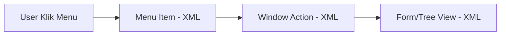

# 📘 Odoo Coding Syntax & Structure Handbook (Bahasa Indonesia)

Panduan praktis ini dirancang khusus untuk memandu Anda memahami struktur penulisan kode (*coding syntax*) di Odoo, baik di sisi backend (Python ORM) maupun frontend (XML Views). 

---

## 1. Dasar Sintaks Odoo Python

Logika bisnis Odoo ditulis menggunakan Python dengan memanfaatkan framework **ORM (Object-Relational Mapping)** milik Odoo. Berikut adalah anatomi dari sebuah class model dasar Odoo.

```python
# -*- coding: utf-8 -*-
# 1. Selalu import models, fields, api dari package odoo
from odoo import models, fields, api
from odoo.exceptions import ValidationError

# 2. Definisikan class Python yang mewarisi models.Model
class LibraryBook(models.Model):
    # 3. _name: Mendefinisikan nama model (menjadi nama tabel database: library_book)
    _name = 'library.book'
    
    # 4. _description: Label nama model untuk dibaca manusia di UI/Sistem
    _description = 'Informasi Buku Perpustakaan'
    
    # 5. _inherit: Mewarisi model lain untuk modifikasi (opsional)
    # _inherit = 'res.partner' 

    # 6. Definisi Fields (Kolom Tabel)
    name = fields.Char(string='Judul Buku', required=True)
    active = fields.Boolean(string='Aktif?', default=True)
    isbn = fields.Char(string='Nomor ISBN')
    copies = fields.Integer(string='Jumlah Salinan', default=1)
    
    # 7. Model Method (Logika Bisnis)
    def action_check_copies(self):
        # 'self' mewakili recordset (kumpulan record aktif)
        for record in self:
            if record.copies < 0:
                raise ValidationError("Jumlah salinan tidak boleh negatif!")
```

### Penjelasan Anatomi Dasar:
* **`models.Model`**: Merupakan kelas utama Odoo. Setiap kelas yang mewarisi kelas ini akan dibuatkan tabelnya secara otomatis di PostgreSQL.
* **`_name`**: Atribut wajib untuk model baru. Odoo akan mengkonversi titik (`.`) menjadi underscore (`_`) untuk nama tabel database.
* **`_inherit`**: Digunakan jika Anda ingin memodifikasi model bawaan (misal menambah field ke model *Customer/Partner* bawaan).
* **`self`**: Dalam Odoo, `self` hampir selalu berupa **Recordset** (bukan sekadar single object seperti Python murni). Bahkan jika hanya ada satu record di layar, `self` diperlakukan sebagai list berisi satu item.
* **`self.env`**: Pintu masuk ke seluruh sistem Odoo. Digunakan untuk memanggil model lain (`self.env['res.partner']`), memeriksa user aktif (`self.env.user`), atau database cursor (`self.env.cr`).

---

## 2. ORM Odoo Secara Detail

Metode ORM digunakan untuk melakukan query data tanpa menulis SQL mentah.

### 1. `search`
Mengambil recordset berdasarkan filter kriteria (domain).
* **Kapan digunakan**: Saat ingin mencari record di database berdasarkan kondisi tertentu.
* **Contoh Code**:
```python
# Mencari semua buku dengan jumlah salinan lebih dari 5 yang aktif
books = self.env['library.book'].search([
    ('copies', '>', 5),
    ('active', '=', True)
])
```

### 2. `browse`
Mengambil recordset berdasarkan list ID database.
* **Kapan digunakan**: Saat Anda sudah memegang ID database mentah (misal dari request API atau log) dan ingin mendapatkan objek data lengkapnya.
* **Contoh Code**:
```python
# Mengambil data buku dengan ID 12 dan 15
book_records = self.env['library.book'].browse([12, 15])
```

### 3. `create`
Menyisipkan record baru ke database. Menerima argument berupa `dict` berisi pasangan nama field dan nilainya.
* **Kapan digunakan**: Untuk menambahkan data baru programatik.
* **Contoh Code**:
```python
new_book = self.env['library.book'].create({
    'name': 'Belajar Odoo 18',
    'isbn': '978-602-1234-56-7',
    'copies': 10
})
# new_book sekarang berisi recordset buku yang baru dibuat (dengan ID database)
```

### 4. `write`
Memperbarui data yang ada di database. Menerima argument berupa `dict`.
* **Kapan digunakan**: Untuk memperbarui/mengedit recordset yang aktif.
* **Contoh Code**:
```python
# Mengubah data copies pada buku yang baru dibuat
new_book.write({
    'copies': 15,
    'isbn': '978-602-1234-56-0'
})
```

### 5. `unlink`
Menghapus record dari database secara permanen.
* **Kapan digunakan**: Saat ingin mendelete recordset.
* **Contoh Code**:
```python
stale_books = self.env['library.book'].search([('copies', '=', 0)])
stale_books.unlink() # Menghapus semua buku yang tidak memiliki salinan
```

### 6. `mapped`
Mengambil list nilai dari sebuah field dari recordset secara cepat, atau menelusuri relasi.
* **Kapan digunakan**: Mengambil daftar nilai kolom tertentu tanpa melakukan perulangan `for` manual.
* **Contoh Code**:
```python
# Mengambil list nama buku dari recordset
titles = books.mapped('name') # Hasil: ['Buku A', 'Buku B', 'Buku C']
```

### 7. `filtered`
Menyaring recordset menggunakan fungsi Python. Operasi ini berjalan di memori local (tidak memicu query SQL baru).
* **Kapan digunakan**: Menyaring data dari recordset yang sudah ada di memori.
* **Contoh Code**:
```python
# Menyaring buku yang judulnya mengandung kata 'Odoo'
odoo_books = books.filtered(lambda r: 'Odoo' in r.name)
```

### 8. `sorted`
Mengurutkan recordset berdasarkan nama field atau fungsi tertentu di memori.
* **Kapan digunakan**: Mengubah urutan tampilan recordset.
* **Contoh Code**:
```python
# Mengurutkan buku berdasarkan jumlah copies terbanyak
ordered_books = books.sorted(key=lambda r: r.copies, reverse=True)
```

### 9. `sudo`
Membuat instance recordset baru dengan hak akses admin (bypass seluruh Security Rules/ACL).
* **Kapan digunakan**: Ketika user biasa butuh menjalankan fungsi yang hak aksesnya dibatasi oleh sistem.
* **Contoh Code**:
```python
# Mencari data buku melewati batasan aturan hak akses record rule
all_books = self.env['library.book'].sudo().search([])
```

### 10. `search_count`
Menghitung jumlah record yang memenuhi filter domain tanpa mengambil datanya ke memori.
* **Kapan digunakan**: Sangat baik untuk performa jika Anda hanya butuh jumlah baris data, bukan objek datanya.
* **Contoh Code**:
```python
# Menghitung berapa banyak buku yang tidak aktif
inactive_count = self.env['library.book'].search_count([('active', '=', False)])
```

### 11. `read_group`
Melakukan pengelompokan data (*Group By*) tingkat database (seperti SQL `GROUP BY`).
* **Kapan digunakan**: Membuat kalkulasi statistik cepat seperti total copies per kategori buku.
* **Contoh Code**:
```python
# Menghitung total copies dikelompokkan berdasarkan field author_id
result = self.env['library.book'].read_group(
    domain=[('active', '=', True)],
    fields=['copies'],
    groupby=['author_id']
)
# Hasil berupa list of dict dengan agregasi data
```

### 12. `ensure_one`
Memvalidasi bahwa recordset hanya berisi tepat satu record. Jika kosong atau lebih dari satu, sistem akan memicu crash/error.
* **Kapan digunakan**: Di awal method yang didesain hanya untuk memproses satu dokumen spesifik.
* **Contoh Code**:
```python
def action_print_book(self):
    self.ensure_one() # Mencegah error jika user memilih banyak buku di list view lalu klik cetak
    print(self.name)
```

⚠️ **Common Mistake**: Memanggil field langsung dari `self` tanpa `self.ensure_one()` di dalam loop atau method global. Jika `self` berisi 2 record, memanggil `self.name` akan memicu error `Expected singleton`. Selalu gunakan perulangan `for record in self:` jika method Anda bisa dipicu dari list view.

---

## 3. Sintaks Field Odoo

Field merepresentasikan kolom tabel database. 

### Tipe Field Dasar

```python
name = fields.Char(string='Judul', required=True, help='Judul Buku')
description = fields.Text(string='Deskripsi/Sinopsis')
quantity = fields.Integer(string='Stok', default=0)
price = fields.Float(string='Harga Jual', digits=(16, 2)) # 16 total digit, 2 di belakang koma
is_available = fields.Boolean(string='Tersedia', default=True)
publish_date = fields.Date(string='Tanggal Terbit')
last_updated = fields.Datetime(string='Waktu Update', default=fields.Datetime.now)
cover_image = fields.Binary(string='Cover Buku') # Untuk file upload / gambar
status = fields.Selection([
    ('draft', 'Draft'),
    ('published', 'Terbit'),
    ('archived', 'Diarsipkan')
], string='Status', default='draft')
website_preview = fields.Html(string='Review HTML')
```

### Monetary Field
Monetary field khusus digunakan untuk menangani nilai uang dengan presisi tinggi dan otomatis menampilkan simbol mata uang yang sesuai. Membutuhkan field pembantu `currency_id`.

```python
# 1. Definisikan currency_id terlebih dahulu
currency_id = fields.Many2one('res.currency', string='Mata Uang', 
                              default=lambda self: self.env.company.currency_id)
# 2. Definisikan monetary field
price_monetary = fields.Monetary(string='Harga Sewa', currency_field='currency_id')
```

### Relational Fields (Relasi)

#### 1. Many2one
Menghubungkan ke satu record target (Foreign Key).
```python
author_id = fields.Many2one(
    comodel_name='res.partner', 
    string='Penulis', 
    ondelete='restrict' # restrict / cascade / set null
)
```

#### 2. One2many
Menghubungkan ke banyak record target. Harus memiliki field Many2one balik di tabel tujuan.
```python
# Menghubungkan buku ke tabel salinan buku fisik (library.book.copy)
copy_ids = fields.One2many(
    comodel_name='library.book.copy', 
    inverse_name='book_id', 
    string='Daftar Fisik Buku'
)
```

#### 3. Many2many
Hubungan banyak ke banyak. Odoo akan mengurus tabel perantara secara otomatis.
```python
tag_ids = fields.Many2many(
    comodel_name='library.book.tag',
    relation='library_book_tag_rel', # nama tabel perantara
    column1='book_id',               # kolom relasi model ini
    column2='tag_id',                # kolom relasi model target
    string='Kategori/Tags'
)
```

### Parameter Atribut Field Penting
* **`compute`**: Menghitung nilai field dinamis lewat fungsi python.
* **`related`**: Pintasan untuk membaca field dari record terelasi.
  ```python
  author_email = fields.Char(related='author_id.email', string='Email Penulis', store=True)
  ```
* **`store`**: Secara default, `compute` field tidak disimpan di database. Set `store=True` agar nilai disimpan, sehingga field bisa disearch/difilter.
* **`required`**: Nilai tidak boleh kosong (`NOT NULL` di database).
* **`readonly`**: Field tidak bisa diedit dari UI.
* **`tracking`**: Mengaktifkan pencatatan riwayat perubahan nilai field di chatter bagian bawah form (butuh dependensi modul `mail`).
* **`domain`**: Membatasi opsi data yang bisa dipilih pada field relasi.
  ```python
  # Hanya menampilkan partner yang ditandai sebagai penulis
  author_id = fields.Many2one('res.partner', domain=[('is_author', '=', True)])
  ```
* **`context`**: Mengirimkan parameter metadata saat memilih field relasi.
  ```python
  # Mengisi default field is_author menjadi True saat membuat author baru dari form buku
  author_id = fields.Many2one('res.partner', context={'default_is_author': True})
  ```

---

## 4. XML di Odoo (Frontend)

Odoo menggunakan XML untuk merancang struktur UI. XML diterjemahkan oleh framework Odoo menjadi aplikasi web HTML dinamis (Single Page Application).

### Struktur Dasar XML Odoo
```xml
<?xml version="1.0" encoding="utf-8"?>
<odoo>
    <!-- Mendefinisikan sebuah record konfigurasi sistem -->
    <record id="view_library_book_form" model="ir.ui.view">
        <field name="name">library.book.form</field> <!-- Nama bebas untuk identifikasi -->
        <field name="model">library.book</field>     <!-- Model target UI ini -->
        <field name="arch" type="xml">               <!-- Tipe arsitektur visual -->
            <form string="Buku">
                <!-- Desain UI ditulis di sini -->
            </form>
        </field>
    </record>
</odoo>
```

### Konsep Modifikasi UI dengan XML Inheritance (`xpath`)
Di Odoo, kita dilarang keras mengubah file XML modul asli. Jika ingin mengubah UI modul bawaan, kita mewarisinya menggunakan tag `xpath`.

```xml
<record id="view_partner_form_inherit_library" model="ir.ui.view">
    <field name="name">res.partner.form.inherit.library</field>
    <field name="model">res.partner</field>
    <!-- inherit_id: mereferensikan external ID view asli yang ingin dimodifikasi -->
    <field name="inherit_id" ref="base.view_partner_form"/>
    <field name="arch" type="xml">
        <!-- xpath: mencari lokasi field 'website' di form asli -->
        <xpath expr="//field[@name='website']" position="after">
            <!-- Menambahkan field kustom kita tepat setelah field website -->
            <field name="is_author"/>
        </xpath>
    </field>
</record>
```

---

## 5. Jenis View di Odoo

### 1. Form View
Digunakan untuk melihat, membuat, atau mengedit detail dari satu record data.

```xml
<form string="Form Buku">
    <!-- Header: Untuk tombol status & alur proses -->
    <header>
        <button name="action_publish" string="Terbitkan" type="object" class="btn-primary" invisible="status != 'draft'"/>
        <field name="status" widget="statusbar" statusbar_visible="draft,published"/>
    </header>
    <!-- Sheet: Kertas putih utama layout form -->
    <sheet>
        <div class="oe_title">
            <label for="name" class="oe_edit_only"/>
            <h1><field name="name" placeholder="Judul Buku..."/></h1>
        </div>
        <group>
            <!-- Dibagi dua kolom kiri dan kanan -->
            <group string="Data Utama">
                <field name="author_id"/>
                <field name="isbn"/>
            </group>
            <group string="Stok &amp; Harga">
                <field name="copies"/>
                <field name="price_monetary"/>
            </group>
        </group>
        <!-- Notebook: Tab kontainer di bagian bawah form -->
        <notebook>
            <page string="Deskripsi" name="desc_tab">
                <field name="description" placeholder="Sinopsis buku..."/>
            </page>
        </notebook>
    </sheet>
</form>
```

### 2. Tree/List View
Menampilkan daftar data dalam bentuk baris dan kolom tabel.

```xml
<list string="Daftar Buku" decoration-danger="copies == 0">
    <field name="name"/>
    <field name="author_id"/>
    <field name="isbn"/>
    <field name="copies" sum="Total Stok"/> <!-- sum: otomatis menjumlahkan nilai kolom di bawah -->
    <field name="status" widget="badge"/>
</list>
```

### 3. Search View
Mengatur filter pencarian yang muncul di pojok kanan atas layar Odoo.

```xml
<search string="Cari Buku">
    <field name="name" string="Judul atau ISBN" filter_domain="['|', ('name', 'ilike', self), ('isbn', 'ilike', self)]"/>
    <field name="author_id"/>
    
    <!-- Tombol Filter Cepat -->
    <filter string="Stok Kosong" name="no_stock" domain="[('copies', '=', 0)]"/>
    <filter string="Aktif" name="active_books" domain="[('active', '=', True)]"/>
    
    <!-- Tombol Group By -->
    <group expand="0" string="Group By">
        <filter string="Penulis" name="group_author" context="{'group_by': 'author_id'}"/>
        <filter string="Status" name="group_status" context="{'group_by': 'status'}"/>
    </group>
</search>
```

### 4. Kanban View
Tampilan bertipe kartu/board (seperti Trello).

```xml
<kanban default_group_by="status" class="o_kanban_small_column">
    <field name="name"/>
    <field name="author_id"/>
    <templates>
        <t t-name="card">
            <div class="oe_kanban_global_click">
                <div class="oe_kanban_details">
                    <strong class="o_kanban_record_title"><field name="name"/></strong>
                    <div>Penulis: <field name="author_id"/></div>
                </div>
            </div>
        </t>
    </templates>
</kanban>
```

### 5. Pivot & Graph View
Untuk analisis data analitik bisnis.

```xml
<!-- Pivot: Tabel tabulasi silang -->
<pivot string="Analisis Buku">
    <field name="author_id" type="row"/>
    <field name="status" type="col"/>
    <field name="copies" type="measure"/>
</pivot>

<!-- Graph: Grafik visual -->
<graph string="Grafik Stok Buku" type="bar">
    <field name="author_id"/>
    <field name="copies" type="measure"/>
</graph>
```

---

## 6. XPath di Odoo

XPath digunakan untuk mencari elemen tag di dalam arsitektur XML Odoo bawaan saat melakukan *inheritance*.

### Pola Ekspresi XPath Terpopuler:
* `//field[@name='nama_field']` → Mencari field berdasarkan namanya.
* `//button[@name='nama_method']` → Mencari tombol berdasarkan method pemicunya.
* `//notebook` → Mencari elemen tab notebook pertama.

### Jenis Posisi (`position`):

| Posisi | Keterangan | Contoh |
|--------|------------|--------|
| **`after`** | Menyisipkan setelah elemen target. | `<xpath expr="//field[@name='a']" position="after"><field name="b"/></xpath>` |
| **`before`** | Menyisipkan sebelum elemen target. | `<xpath expr="//field[@name='a']" position="before"><field name="b"/></xpath>` |
| **`inside`** | Menyisipkan di dalam elemen target (di posisi paling bawah). | `<xpath expr="//notebook" position="inside"><page string="Tab Baru">...</page></xpath>` |
| **`replace`** | Mengganti/menimpa elemen target sepenuhnya. | `<xpath expr="//field[@name='a']" position="replace"><field name="a" readonly="1"/></xpath>` |
| **`attributes`** | Hanya memodifikasi atribut elemen target tanpa mengganti isinya. | `<xpath expr="//field[@name='a']" position="attributes"><attribute name="required">1</attribute></xpath>` |

---

## 7. Action & Menu XML

Menuitem di Odoo tidak bekerja sendirian, menu membutuhkan **Window Action** untuk mengetahui model mana yang harus dibuka dan view apa yang harus ditampilkan.



### Struktur Penulisan Kode:

```xml
<!-- 1. Buat Window Action Terlebih Dahulu -->
<record id="action_library_book" model="ir.actions.act_window">
    <field name="name">Daftar Buku</field>
    <field name="res_model">library.book</field>
    <field name="view_mode">list,form,kanban</field> <!-- Urutan view yang bisa dibuka -->
    <field name="search_view_id" ref="view_library_book_search"/>
    <field name="help" type="html">
        <p class="o_view_nocontent_smiling_face">Buat data buku pertama Anda!</p>
    </field>
</record>

<!-- 2. Definisikan Menu Utama (Top Bar) -->
<menuitem id="menu_library_root" name="Perpustakaan" sequence="10"/>

<!-- 3. Definisikan Sub-menu yang memiliki Action untuk membuka halaman -->
<menuitem id="menu_library_books" 
          name="Semua Buku" 
          parent="menu_library_root" 
          action="action_library_book" 
          sequence="10"/>
```

---

## 8. Button & Action

Tombol di Odoo didefinisikan menggunakan tag `<button>` di dalam `<header>` atau `<sheet>` form view.

### Jenis Tombol (`type`):
1. **`type="object"`**: Memanggil method Python yang didefinisikan di model. Nama tombol `name` harus sama dengan nama fungsi di Python.
2. **`type="action"`**: Memicu Window Action XML tertentu (misal membuka wizard pop-up). Nama tombol `name` berisi external ID dari action XML target.

```xml
<!-- Tombol pemicu Python (object) dengan dialog konfirmasi sebelum jalan -->
<button name="action_set_draft" string="Kembalikan ke Draft" type="object" confirm="Apakah Anda yakin?"/>

<!-- Tombol pemicu Action XML (membuka window wizard) -->
<button name="%(action_wizard_library_report)d" string="Cetak Laporan Kustom" type="action" class="btn-primary"/>
```

Pemicu Python di model:
```python
def action_set_draft(self):
    self.ensure_one()
    self.status = 'draft' # Mengubah status record saat tombol diklik
```

---

## 9. Security XML & CSV

### 1. Izin Akses CRUD Model (`ir.model.access.csv`)
Tanpa file ini, model baru Anda tidak akan muncul di menu user biasa dan akan memicu peringatan error keamanan saat startup.
* Berkas disimpan di: `security/ir.model.access.csv`
* Contoh baris data:
```csv
id,name,model_id:id,group_id:id,perm_read,perm_write,perm_create,perm_unlink
access_library_book_user,lib.book.user,model_library_book,base.group_user,1,1,1,0
```
* **`model_library_book`**: Prefiks `model_` followed by model name (dots replaced with underscore).
* **`base.group_user`**: Izin untuk semua user internal aktif Odoo.

### 2. Record Rule (Row-Level Security)
Membatasi hak akses data secara dinamis berdasarkan nilai baris data (domain).

```xml
<record id="rule_only_active_books" model="ir.rule">
    <field name="name">Hanya Buku Aktif</field>
    <field name="model_id" ref="model_library_book"/>
    <!-- Mengunci agar user biasa hanya bisa melihat buku yang bertanda active=True -->
    <field name="groups" eval="[(4, ref('base.group_user'))]"/>
    <field name="domain_force">[('active', '=', True)]</field>
</record>
```

---

## 10. QWeb Template

QWeb adalah template engine bawaan Odoo untuk merancang PDF Report.

### Atribut Utama QWeb:
* **`t-if`**: Pengondisian dinamis.
* **`t-foreach`**: Perulangan data recordset.
* **`t-esc`**: Menampilkan teks biasa dengan menyaring karakter HTML (aman).
* **`t-field`**: Menampilkan nilai field Odoo lengkap dengan format widget bawaannya (format mata uang, tanggal, dll).
* **`t-call`**: Memanggil template QWeb lain (reusabilitas).

### Contoh Template Report QWeb:

```xml
<template id="report_book_details_template">
    <t t-call="web.html_container">
        <t t-foreach="docs" t-as="o">
            <t t-call="web.external_layout">
                <div class="page">
                    <h2 class="text-center">DETAIL BUKU PERPUSTAKAAN</h2>
                    <br/>
                    <div class="row">
                        <div class="col-6">
                            <strong>Judul Buku:</strong> <span t-field="o.name"/><br/>
                            <strong>ISBN:</strong> <span t-field="o.isbn"/><br/>
                        </div>
                        <div class="col-6">
                            <strong>Penulis:</strong> <span t-field="o.author_id.name"/><br/>
                            <strong>Harga Sewa:</strong> <span t-field="o.price_monetary"/><br/>
                        </div>
                    </div>
                    
                    <!-- Kondisi if dan loop table -->
                    <h4 class="mt-4">Daftar Salinan Fisik</h4>
                    <table class="table table-striped">
                        <thead>
                            <tr>
                                <th>Kode Fisik</th>
                                <th>Kondisi</th>
                            </tr>
                        </thead>
                        <tbody>
                            <t t-if="not o.copy_ids">
                                <tr><td colspan="2" class="text-center">Tidak ada salinan fisik tersedia</td></tr>
                            </t>
                            <t t-foreach="o.copy_ids" t-as="copy">
                                <tr>
                                    <td><span t-field="copy.barcode"/></td>
                                    <td><span t-field="copy.condition"/></td>
                                </tr>
                            </t>
                        </tbody>
                    </table>
                </div>
            </t>
        </t>
    </t>
</template>
```

---

## 11. Studi Kasus Mini Project: Manajemen Buku Perpustakaan

Di bagian ini, kita akan membuat modul bernama `library_mgmt` lengkap dari awal dengan fitur CRUD buku, relasi penulis, status draft/ready, tombol konfirmasi, dan security rules.

### Langkah 1: Struktur Folder
```text
addons/library_mgmt/
├── __init__.py
├── __manifest__.py
├── security/
│   └── ir.model.access.csv
├── models/
│   ├── __init__.py
│   └── book.py
└── views/
    └── book_views.xml
```

### Langkah 2: Berkas Konfigurasi Modul (`__manifest__.py`)
```python
# -*- coding: utf-8 -*-
{
    'name': 'Manajemen Buku Perpustakaan',
    'version': '18.0.1.0.0',
    'category': 'Services',
    'summary': 'Modul sederhana untuk melacak inventaris buku perpustakaan.',
    'depends': ['base'],
    'data': [
        'security/ir.model.access.csv',
        'views/book_views.xml',
    ],
    'installable': True,
    'application': True,
    'license': 'LGPL-3',
}
```

### Langkah 3: Init Modules
Di `addons/library_mgmt/__init__.py`:
```python
from . import models
```

Di `addons/library_mgmt/models/__init__.py`:
```python
from . import book
```

### Langkah 4: Model Python (`models/book.py`)
```python
# -*- coding: utf-8 -*-
from odoo import models, fields, api
from odoo.exceptions import ValidationError

class LibraryBook(models.Model):
    _name = 'library.mgmt.book'
    _description = 'Buku Perpustakaan'
    _order = 'name asc' # Urutan default list view berdasarkan judul buku A-Z

    name = fields.Char(string='Judul Buku', required=True)
    isbn = fields.Char(string='Nomor ISBN')
    publish_date = fields.Date(string='Tanggal Terbit')
    copies = fields.Integer(string='Jumlah Salinan', default=1)
    
    # Relasi Many2one ke model partner bawaan Odoo
    author_id = fields.Many2one('res.partner', string='Penulis', domain=[('is_company', '=', False)])
    
    status = fields.Selection([
        ('draft', 'Draft/Baru'),
        ('ready', 'Siap Dipinjam'),
        ('lost', 'Hilang/Rusak')
    ], string='Status', default='draft', readonly=True)

    # Validasi Constraint Database
    @api.constrains('copies')
    def _check_copies(self):
        for record in self:
            if record.copies <= 0:
                raise ValidationError("Jumlah salinan buku minimal harus bernilai 1!")

    # Tombol Actions (Python Logic)
    def action_confirm_ready(self):
        for record in self:
            if not record.isbn:
                raise ValidationError("Buku tidak bisa dikonfirmasi tanpa Nomor ISBN!")
            record.status = 'ready'

    def action_set_draft(self):
        for record in self:
            record.status = 'draft'
```

### Langkah 5: Desain XML UI (`views/book_views.xml`)
```xml
<?xml version="1.0" encoding="utf-8"?>
<odoo>
    <!-- List / Tree View -->
    <record id="view_library_book_list" model="ir.ui.view">
        <field name="name">library.mgmt.book.list</field>
        <field name="model">library.mgmt.book</field>
        <field name="arch" type="xml">
            <list string="Daftar Buku Perpustakaan">
                <field name="name"/>
                <field name="author_id"/>
                <field name="isbn"/>
                <field name="copies"/>
                <field name="status" widget="badge" decoration-success="status == 'ready'" decoration-warning="status == 'draft'"/>
            </list>
        </field>
    </record>

    <!-- Form View -->
    <record id="view_library_book_form" model="ir.ui.view">
        <field name="name">library.mgmt.book.form</field>
        <field name="model">library.mgmt.book</field>
        <field name="arch" type="xml">
            <form string="Form Buku">
                <!-- Header: Alur kerja & tombol aksi -->
                <header>
                    <button name="action_confirm_ready" string="Konfirmasi Siap" type="object" class="btn-primary" invisible="status != 'draft'"/>
                    <button name="action_set_draft" string="Set ke Draft" type="object" invisible="status == 'draft'"/>
                    <field name="status" widget="statusbar"/>
                </header>
                <!-- Kertas Sheet Utama -->
                <sheet>
                    <div class="oe_title">
                        <label for="name" class="oe_edit_only"/>
                        <h1>
                            <field name="name" placeholder="Contoh: Laskar Pelangi..."/>
                        </h1>
                    </div>
                    <group>
                        <group string="Informasi Buku">
                            <field name="author_id" options="{'no_create': True, 'no_open': True}"/>
                            <field name="isbn"/>
                        </group>
                        <group string="Manajemen Stok">
                            <field name="publish_date"/>
                            <field name="copies"/>
                        </group>
                    </group>
                </sheet>
            </form>
        </field>
    </record>

    <!-- Search View -->
    <record id="view_library_book_search" model="ir.ui.view">
        <field name="name">library.mgmt.book.search</field>
        <field name="model">library.mgmt.book</field>
        <field name="arch" type="xml">
            <search string="Cari Buku">
                <field name="name"/>
                <field name="isbn"/>
                <filter string="Siap Dipinjam" name="ready_status" domain="[('status', '=', 'ready')]"/>
                <filter string="Draft" name="draft_status" domain="[('status', '=', 'draft')]"/>
                <group expand="0" string="Group By">
                    <filter string="Penulis" name="group_author" context="{'group_by': 'author_id'}"/>
                </group>
            </search>
        </field>
    </record>

    <!-- Action Window -->
    <record id="action_library_mgmt_book" model="ir.actions.act_window">
        <field name="name">Buku Perpustakaan</field>
        <field name="res_model">library.mgmt.book</field>
        <field name="view_mode">list,form</field>
        <field name="context">{'search_default_ready_status': 1}</field> <!-- Filter default langsung aktif -->
        <field name="help" type="html">
            <p class="o_view_nocontent_smiling_face">Selamat datang di modul Perpustakaan! Tambahkan buku pertama Anda.</p>
        </field>
    </record>

    <!-- Menu Items -->
    <menuitem id="menu_library_mgmt_root" name="Perpustakaan Kustom" sequence="1"/>
    <menuitem id="menu_library_mgmt_books" name="Koleksi Buku" parent="menu_library_mgmt_root" action="action_library_mgmt_book" sequence="10"/>
</odoo>
```

### Langkah 6: Hak Akses Keamanan (`security/ir.model.access.csv`)
```csv
id,name,model_id:id,group_id:id,perm_read,perm_write,perm_create,perm_unlink
access_library_mgmt_book,lib.mgmt.book,model_library_mgmt_book,base.group_user,1,1,1,1
```

---

## 12. Cheatsheet Cepat

### Sintaks ORM Terpopuler
```python
# Mencari data record dengan kondisi OR
records = self.env['model.name'].search(['|', ('field_a', '=', '1'), ('field_b', '=', '2')])

# Update data massal tanpa looping for
self.env['model.name'].search([('status', '=', 'draft')]).write({'status': 'cancel'})

# Bypass security check untuk update data log system
self.env['system.log'].sudo().create({'name': 'User log event'})
```

### Snippet Hubungan Relasi (*Relation Fields*)
```python
# Many2one (Model Target, Nama Label)
partner_id = fields.Many2one('res.partner', string='Pelanggan')

# One2many (Model Target, Field Many2one Terbalik di Target, Nama Label)
line_ids = fields.One2many('order.line', 'order_id', string='Detail Order')

# Many2many (Model Target, Tabel Link Bebas, Kolom Relasi A, Kolom Relasi B, Nama Label)
tag_ids = fields.Many2many('tag.model', 'order_tag_rel', 'order_id', 'tag_id', string='Tags')
```

### XPath snippet yang sering dipakai
```xml
<!-- Mengubah atribut field menjadi readonly -->
<xpath expr="//field[@name='phone']" position="attributes">
    <attribute name="readonly">1</attribute>
</xpath>

<!-- Menyisipkan tab halaman baru di notebook form view -->
<xpath expr="//notebook" position="inside">
    <page string="Tab Khusus" name="custom_tab">
        <group>
            <field name="custom_field"/>
        </group>
    </page>
</xpath>
```
